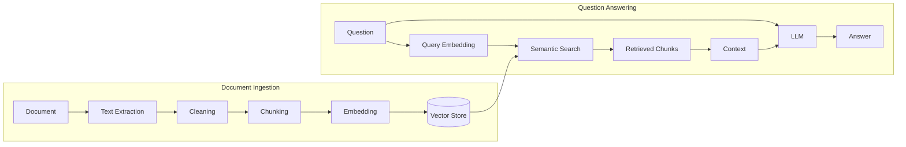
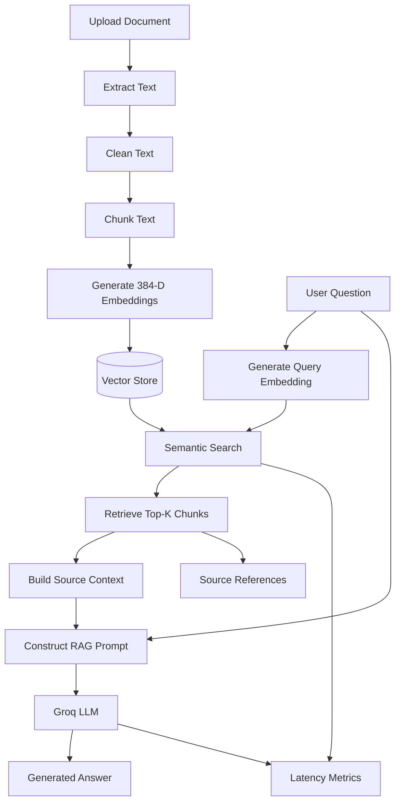

# Retrieval-Augmented Generation (RAG) Workflow

## 1. Introduction

Retrieval-Augmented Generation (RAG) is an AI architecture that
combines information retrieval with Large Language Model generation.

Instead of sending a user's question directly to an LLM, the system
first searches an external knowledge base for information relevant to
the question.

The retrieved information is then supplied to the LLM as context.

The basic workflow is:

```text
User Question
     |
     v
Retrieve Relevant Information
     |
     v
Build Context
     |
     v
Send Context + Question to LLM
     |
     v
Generate Grounded Answer
```

The purpose of RAG in this project is to allow the AI assistant to
answer questions using software-engineering documents uploaded by the
user.

---

# 2. Why RAG Is Required

A general-purpose LLM contains knowledge learned during model
training, but it does not automatically know the contents of private
or newly uploaded project documents.

Consider an internal document containing:

> Apache Kafka is used for asynchronous communication between the
> Payment Service and Notification Service.

A general-purpose LLM may not know this project-specific design
decision.

With RAG, the relevant document content is retrieved first and
provided to the model.

Therefore:

```text
Without RAG

Question
   |
   v
LLM
   |
   v
Answer based mainly on model knowledge
```

Compared with:

```text
With RAG

Question
   |
   v
Project Knowledge Base
   |
   v
Relevant Evidence
   |
   v
LLM
   |
   v
Answer based on retrieved evidence
```

---

# 3. RAG Architecture in This Project

The implemented RAG pipeline contains two major phases:

1. Offline / ingestion phase
2. Online / query phase



---

# 4. Phase 1: Document Ingestion

The ingestion phase converts uploaded documents into searchable
semantic representations.

The current application supports:

- PDF
- TXT
- Markdown

The ingestion pipeline is:

```text
Document
   ↓
Validation
   ↓
Storage
   ↓
Text Extraction
   ↓
Text Cleaning
   ↓
Chunking
   ↓
Embedding Generation
   ↓
Vector Storage
```

---

# 5. Text Extraction

The first processing step converts the uploaded document into plain
text.

For example:

```text
PDF document

        ↓

Text extraction

        ↓

"The Payment Service uses Apache Kafka..."
```

Different file formats require different extraction mechanisms.

The extracted text becomes the input for subsequent processing.

---

# 6. Text Cleaning

Extracted text may contain formatting artifacts such as:

- Extra whitespace
- Repeated line breaks
- Control characters
- PDF extraction artifacts
- Bullet symbols

The system normalizes the extracted text before chunking.

For example:

```text
Raw:

"Payment Service     uses Kafka.\n\n\nNotification Service..."

Cleaned:

"Payment Service uses Kafka.

Notification Service..."
```

Cleaning improves the consistency of the text processed by the
embedding model.

---

# 7. Why Documents Are Chunked

A complete document is generally too large and too broad to use as a
single retrieval unit.

Instead, the document is divided into smaller sections called
**chunks**.

Example:

```text
Document
   |
   +---- Chunk 0
   |
   +---- Chunk 1
   |
   +---- Chunk 2
   |
   +---- Chunk 3
```

Each chunk becomes an independently searchable unit.

This allows the retrieval system to identify the specific portions of
a document that are most relevant to a question.

---

# 8. Current Chunking Configuration

The current implementation uses:

```text
Chunk size    = 1000 characters
Chunk overlap = 200 characters
```

Conceptually:

```text
Chunk 1
|--------------------------|

                    <---- overlap ---->

                    |--------------------------|
                              Chunk 2
```

If Chunk 1 covers characters:

```text
0 - 999
```

the following chunk can start before character 1000 so that some
information is shared between adjacent chunks.

---

# 9. Why Chunk Overlap Is Used

Important information can occur near a chunk boundary.

Without overlap:

```text
Chunk 1:
"The Payment Service publishes payment"

Chunk 2:
"events to Kafka for downstream processing."
```

The semantic meaning is split between two chunks.

With overlap, some surrounding information is repeated:

```text
Chunk 1:
"The Payment Service publishes payment events to Kafka..."

Chunk 2:
"...payment events to Kafka for downstream processing..."
```

This can preserve context around chunk boundaries.

However, excessive overlap also creates duplicated information and
increases storage and retrieval cost.

Therefore, chunk overlap is a parameter that can be experimentally
evaluated.

---

# 10. Vector Embeddings

Computers cannot perform semantic similarity search directly over
natural-language sentences.

The text must first be represented numerically.

This project uses:

```text
sentence-transformers/all-MiniLM-L6-v2
```

to generate embeddings.

The model converts text into a:

```text
384-dimensional vector
```

Conceptually:

```text
"Kafka is used for asynchronous messaging"

                    ↓

Embedding Model

                    ↓

[0.021, -0.114, 0.342, ..., 0.087]
```

The actual embedding contains 384 numerical dimensions.

---

# 11. Semantic Meaning

Embeddings attempt to represent semantic properties of text.

For example:

```text
Sentence A:
"Kafka is used for communication between services."

Sentence B:
"How do the microservices exchange messages?"
```

Although the sentences use different words, their embeddings may be
relatively close because their meanings are related.

A completely unrelated sentence such as:

```text
"The employee receives twenty days of annual leave."
```

should generally have a less similar representation for that query.

This allows the system to retrieve information based on semantic
similarity rather than exact keyword matching alone.

---

# 12. Embedding Normalization

The current implementation generates normalized embeddings:

```python
model.encode(
    text,
    convert_to_numpy=True,
    normalize_embeddings=True,
)
```

Normalization makes each vector have unit length.

This is useful for similarity calculations and allows the FAISS
implementation to use inner product over normalized vectors as a
cosine-similarity-style ranking mechanism.

---

# 13. Vector Storage

After embeddings are generated, they are stored in a vector-search
system.

The project currently supports:

```text
FAISS
Astra DB
```

The active implementation is controlled using:

```text
VECTOR_STORE=faiss
```

or:

```text
VECTOR_STORE=astra
```

This abstraction allows the retrieval implementation to be changed
without changing the overall RAG workflow.

---

# 14. FAISS Retrieval

FAISS is used as a local vector similarity search implementation.

The project currently uses:

```text
IndexFlatIP
```

Because the embeddings are normalized, inner-product ranking can be
used to rank vectors according to cosine-style similarity.

The FAISS index stores vectors, while SQLite stores metadata required
to identify the corresponding document chunks.

Conceptually:

```text
FAISS position 5
      |
      v
SQLite DocumentChunk
      |
      +-- document_id
      +-- filename
      +-- chunk_index
      +-- content
```

---

# 15. Astra DB Retrieval

Astra DB provides a cloud-based vector database implementation.

For each chunk, Astra stores information including:

```text
_id
document_id
filename
chunk_index
content
$vector
```

The collection uses:

```text
Vector dimension = 384
Similarity metric = cosine
```

Because the metadata and vector are stored together, retrieved
results can directly contain the associated document information.

---

# 16. Query Processing

When the user asks a question such as:

```text
How does the Payment Service communicate with the
Notification Service?
```

the query goes through the same embedding model used for the document
chunks.

```text
Question
    |
    v
all-MiniLM-L6-v2
    |
    v
384-dimensional query vector
```

Using the same embedding model is important because document chunks
and questions must exist in a compatible vector space.

---

# 17. Semantic Search

The query vector is compared against stored document vectors.

Conceptually:

```text
Query Vector
     |
     +---- similarity ---- Chunk A
     |
     +---- similarity ---- Chunk B
     |
     +---- similarity ---- Chunk C
     |
     +---- similarity ---- Chunk D
```

The results are ranked according to vector similarity.

---

# 18. Top-K Retrieval

The system does not send every stored document chunk to the LLM.

Instead, it retrieves the highest-ranked chunks.

This is called **Top-K retrieval**.

For:

```text
top_k = 3
```

the system returns the three highest-ranked chunks.

Example:

```text
Rank    Chunk    Similarity
---------------------------
1       12       0.768
2       7        0.634
3       6        0.630
```

The exact numerical scores depend on the retrieval implementation and
should not be interpreted independently of the retrieval method.

---

# 19. Why Top-K Matters

If Top-K is too small, important evidence may not be retrieved.

For example:

```text
top_k = 1
```

may retrieve only one part of an answer when relevant information is
distributed across multiple chunks.

If Top-K is too large, irrelevant information may be added to the LLM
context.

For example:

```text
top_k = 20
```

may introduce unrelated chunks and increase:

- Prompt size
- Generation cost
- Processing time
- Context noise

Therefore, Top-K represents an important experimental parameter.

The current default is:

```text
top_k = 5
```

---

# 20. Context Construction

Retrieved chunks are converted into a structured context before being
sent to the LLM.

Example:

```text
[Source 1]
File: payment-architecture.md
Chunk: 4

The Payment Service publishes events through Apache Kafka...

[Source 2]
File: notification-service.md
Chunk: 2

The Notification Service consumes payment events...
```

This structure provides both content and source identity to the LLM.

---

# 21. Prompt Construction

The final LLM input contains two important components:

```text
Retrieved Context
        +
User Question
```

The system also provides instructions that require the model to use
only the retrieved context.

Conceptually:

```text
SYSTEM INSTRUCTION

Answer using only the supplied document context.
Do not invent unsupported information.

RETRIEVED CONTEXT

[Source 1]
...

[Source 2]
...

USER QUESTION

How does the Payment Service communicate with the
Notification Service?
```

---

# 22. Answer Generation

The constructed prompt is sent to the configured LLM through the
Groq API.

The current configured model is:

```text
openai/gpt-oss-20b
```

The model receives project-specific evidence in its context and
generates a natural-language answer.

For example:

```text
The Payment Service communicates asynchronously with the
Notification Service using Apache Kafka.
```

---

# 23. Source References

The system returns retrieved sources together with the answer.

Each source currently contains:

```text
source_number
chunk_id
document_id
filename
chunk_index
similarity score
```

Example:

```json
{
  "source_number": 1,
  "filename": "test_document.txt",
  "chunk_index": 0,
  "score": 0.767905
}
```

This provides traceability between the generated response and the
retrieval process.

---

# 24. Unsupported Questions

An important requirement is handling questions for which the
knowledge base does not contain sufficient information.

For example, if the indexed documents contain no information about
Rust or blockchain and the user asks:

```text
Does the candidate have experience developing blockchain
applications using Rust?
```

the desired behavior is not to invent an answer.

The prompt instructs the LLM to state that the available documents do
not provide enough information.

This helps reduce unsupported generation.

However, prompt instructions alone do not mathematically guarantee
that hallucinations cannot occur. Unsupported-answer behavior must
therefore be evaluated experimentally.

---

# 25. RAG Does Not Eliminate Hallucination

RAG can provide relevant external evidence to an LLM, but it does not
guarantee that every generated statement is correct.

Errors can still occur if:

- Retrieval returns irrelevant chunks.
- Relevant information is not retrieved.
- Chunk boundaries remove important context.
- The embedding model ranks content incorrectly.
- The LLM misinterprets retrieved information.
- The LLM introduces claims not supported by the supplied context.

Therefore, this project evaluates both retrieval quality and answer
groundedness.

---

# 26. Retrieval vs Generation

The RAG pipeline contains two separate AI-related tasks.

## Retrieval

```text
Question
   ↓
Embedding
   ↓
Vector Search
   ↓
Relevant Chunks
```

The retrieval system decides:

> Which document information should the LLM receive?

## Generation

```text
Question + Retrieved Chunks
             ↓
            LLM
             ↓
           Answer
```

The generation system decides:

> How should the retrieved information be expressed as an answer?

Separating these two stages is important during evaluation because an
incorrect answer may result from either poor retrieval or poor
generation.

---

# 27. Performance Measurement

The current RAG API measures three timing values.

### Retrieval Time

Time required to:

```text
Generate query embedding
+
Search vector store
+
Retrieve relevant chunks
```

### Generation Time

Time required for the LLM to generate the answer.

### Total Time

Total RAG processing time.

Conceptually:

```text
Total Time
   =
Retrieval Time
   +
Generation Time
   +
small orchestration overhead
```

The API exposes:

```json
{
  "retrieval_time_ms": 2682.04,
  "generation_time_ms": 2199.99,
  "total_time_ms": 4882.06
}
```

These values can later be collected across multiple experiments.

---

# 28. FAISS and Astra Scores

The project has already demonstrated an important experimental
observation.

The same query can produce similar retrieval rankings from FAISS and
Astra while producing different raw numerical scores.

For example, during development a supported query produced a top
FAISS score around:

```text
0.457
```

while the Astra implementation produced a top score around:

```text
0.729
```

The retrieved chunk ranking was nevertheless very similar.

Therefore:

> Raw similarity values from different vector-store implementations
> should not automatically be treated as directly comparable
> confidence scores.

Evaluation should consider retrieval relevance and ranking rather
than assuming that the backend producing the larger raw number is
more accurate.

---

# 29. Experimental Parameters

The RAG architecture allows several parameters to be evaluated.

Examples include:

```text
Chunk size
Chunk overlap
Top-K
Vector store
Query type
Supported vs unsupported question
```

Potential configurations could include:

```text
Experiment A
Chunk size = 500
Top-K = 3

Experiment B
Chunk size = 1000
Top-K = 5

Experiment C
Chunk size = 1500
Top-K = 5
```

Results can then be compared using defined evaluation metrics.

---

# 30. RAG vs LLM-Only Baseline

One of the main experiments will compare:

## Baseline

```text
Question
    ↓
LLM
    ↓
Answer
```

with:

## Proposed RAG System

```text
Question
    ↓
Semantic Retrieval
    ↓
Project Evidence
    ↓
LLM
    ↓
Answer + Sources
```

The same question set should be used for both approaches.

Possible evaluation dimensions include:

- Correctness
- Groundedness
- Unsupported claims
- Ability to answer project-specific questions
- Response latency

---

# 31. Complete RAG Workflow

The complete implemented workflow can be summarized as:



---

# 32. Simple Viva Explanation

If asked:

> What is RAG in your project?

A concise explanation is:

> Retrieval-Augmented Generation combines semantic information
> retrieval with an LLM. In my system, uploaded software engineering
> documents are divided into chunks and converted into vector
> embeddings. When a user asks a question, I generate an embedding for
> the question and perform semantic search to retrieve the most
> relevant chunks. Those chunks are supplied as context to the LLM.
> The LLM then generates an answer based on that retrieved project
> information, and the system returns the corresponding sources.

If asked:

> Why not simply use an LLM?

A concise explanation is:

> A general LLM does not automatically know private or newly uploaded
> project documentation. RAG provides the model with relevant
> project-specific information at query time and allows the answer to
> be associated with retrieved evidence.

If asked:

> Does RAG completely prevent hallucinations?

Answer:

> No. RAG can reduce unsupported generation by providing relevant
> evidence, but hallucination is still possible if retrieval is poor
> or if the LLM generates claims beyond the retrieved context.
> Therefore, groundedness and unsupported-answer behavior are part of
> my evaluation.

---

# 33. Summary

The RAG pipeline used in this project consists of:

```text
Documents
   ↓
Chunking
   ↓
Embeddings
   ↓
Vector Store
   ↓
Semantic Retrieval
   ↓
Top-K Chunks
   ↓
Context
   ↓
LLM
   ↓
Grounded Answer + Sources
```

The architecture transforms a general-purpose language model into an
assistant capable of answering questions using an external,
project-specific software engineering knowledge base.

The effectiveness of this approach will be measured experimentally
rather than assumed.