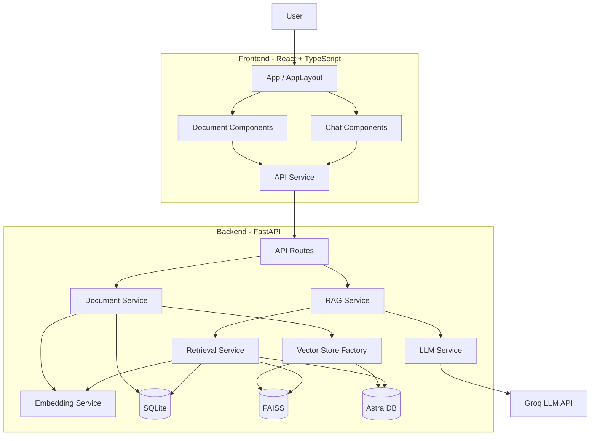
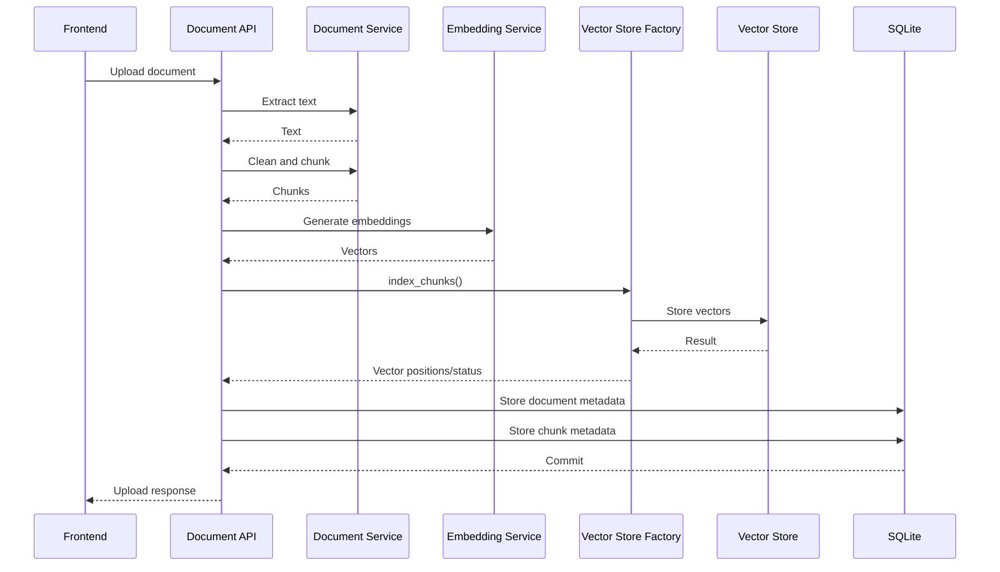
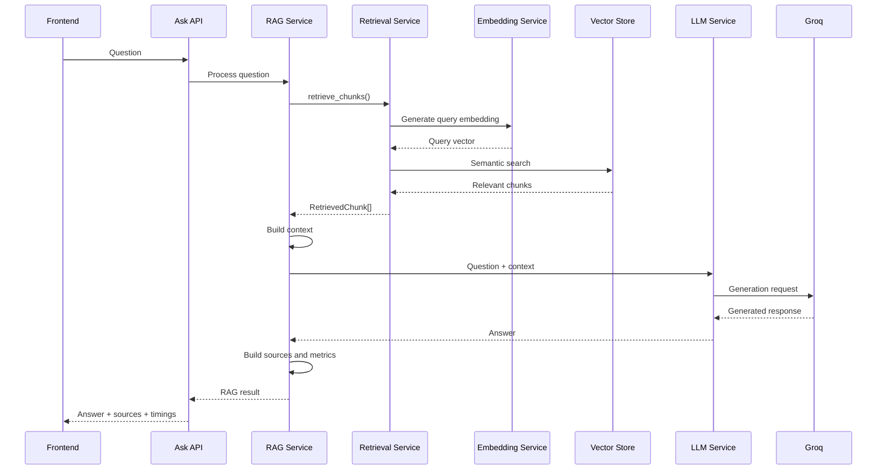

# Module Design

## 1. Introduction

The AI-Powered Software Engineering Assistant follows a modular
architecture.

Instead of implementing document processing, retrieval, embeddings,
LLM communication, and API handling inside a single component, the
application separates these responsibilities into independent
modules.

The main objective of this design is to improve:

- Maintainability
- Testability
- Reusability
- Separation of concerns
- Experimental flexibility
- Technology replacement

The system is divided into two major application areas:

```text
AI RAG Software Engineering Assistant
             |
      +------+------+
      |             |
      v             v
   Frontend       Backend
   React/TS       FastAPI/Python
```

---

# 2. High-Level Module Architecture



---

# 3. Backend Package Structure

The backend follows approximately the following structure:

```text
backend/
│
├── app/
│   ├── api/
│   │   └── v1/
│   │
│   ├── core/
│   │   └── database.py
│   │
│   ├── models/
│   │   ├── document.py
│   │   └── chunk.py
│   │
│   ├── schemas/
│   │
│   ├── services/
│   │   ├── document_service.py
│   │   ├── embedding_service.py
│   │   ├── vector_store.py
│   │   ├── astra_vector_store.py
│   │   ├── vector_store_factory.py
│   │   ├── retrieval_service.py
│   │   ├── rag_service.py
│   │   └── llm_service.py
│   │
│   └── main.py
│
├── data/
│
├── scripts/
│
└── tests/
```

Each module has a specific responsibility.

---

# 4. Application Entry Point

## `main.py`

The FastAPI application starts from:

```text
app/main.py
```

Its primary responsibilities are:

- Creating the FastAPI application
- Configuring application metadata
- Configuring CORS
- Initializing database tables
- Registering API routes

Conceptually:

```text
Application Start
       |
       v
Create FastAPI
       |
       +---- Configure CORS
       |
       +---- Initialize Database
       |
       +---- Register API Router
       |
       v
Application Ready
```

Business logic is intentionally kept outside `main.py`.

---

# 5. API Layer

The API layer exposes backend functionality to the frontend.

The major API operations include:

```text
GET  /health

GET  /documents

POST /documents/upload

GET  /documents/{id}/chunks

POST /ask
```

The API layer is responsible for:

- Receiving HTTP requests
- Validating request data
- Calling application services
- Converting service results into API responses
- Handling API-level errors

The API layer should not contain the complete RAG implementation.

Instead:

```text
API Endpoint
     |
     v
Service Layer
     |
     v
Business Logic
```

This keeps HTTP concerns separate from AI and document-processing
logic.

---

# 6. Document Service

## `document_service.py`

The Document Service handles processing of uploaded documents.

Its responsibilities include:

- Detecting supported file formats
- Extracting text
- Cleaning extracted text
- Splitting text into chunks

The processing workflow is:

```text
Uploaded Document
       |
       v
Determine File Type
       |
       v
Extract Text
       |
       v
Clean Text
       |
       v
Split Into Chunks
       |
       v
Return Processed Content
```

Current supported document formats include:

```text
PDF
TXT
Markdown
```

---

# 7. Text Cleaning Module Responsibility

The document-processing logic removes unnecessary extraction
artifacts before embedding generation.

Examples include:

```text
Control characters
Repeated whitespace
Repeated newlines
PDF bullet artifacts
```

Conceptually:

```text
Raw Extracted Text
        |
        v
     clean_text()
        |
        v
Normalized Text
```

This prevents avoidable formatting noise from becoming part of the
embedding input.

---

# 8. Chunking Responsibility

After cleaning, documents are divided into smaller retrieval units.

The current configuration is:

```text
Chunk size    = 1000 characters
Chunk overlap = 200 characters
```

The result can be represented as:

```text
Document
   |
   +---- Chunk 0
   |
   +---- Chunk 1
   |
   +---- Chunk 2
   |
   +---- Chunk N
```

Each chunk receives metadata such as:

```text
chunk_id
document_id
filename
chunk_index
content
```

These chunks become the units used during semantic retrieval.

---

# 9. Embedding Service

## `embedding_service.py`

The Embedding Service converts natural-language text into numerical
vectors.

The current embedding model is:

```text
sentence-transformers/all-MiniLM-L6-v2
```

Embedding dimension:

```text
384
```

The service provides two main operations.

### Single Embedding

Used primarily for questions:

```text
Question
    |
    v
generate_embedding()
    |
    v
384-D Vector
```

### Batch Embeddings

Used primarily during document ingestion:

```text
Chunk 1
Chunk 2
Chunk 3
   |
   v
generate_embeddings()
   |
   v
Matrix of 384-D vectors
```

Batch processing avoids repeatedly invoking the embedding model
individually for every document chunk.

---

# 10. Embedding Model Caching

The embedding model is cached using an application-level cache.

Conceptually:

```text
First Request
     |
     v
Load MiniLM Model
     |
     v
Cache Model
```

Subsequent requests:

```text
Request
   |
   v
Use Cached Model
```

This avoids loading the model from disk repeatedly.

Model loading can be expensive compared with reusing an already
initialized model.

---

# 11. Local FAISS Vector Store

## `vector_store.py`

This module contains FAISS-specific functionality.

Its responsibilities include:

- Creating a FAISS index
- Loading an existing index
- Saving the index
- Adding embeddings

The current index type is:

```text
IndexFlatIP
```

The embedding dimension is:

```text
384
```

The FAISS module is deliberately separated from higher-level
application logic.

This means other modules do not need to understand how the FAISS
index is persisted.

---

# 12. Astra Vector Store

## `astra_vector_store.py`

This module contains Astra-specific vector-database operations.

Its responsibilities include:

- Connecting to Astra DB
- Accessing the configured collection
- Inserting chunk vectors
- Storing chunk metadata
- Performing semantic vector search

The Astra document contains information similar to:

```text
_id
document_id
filename
chunk_index
content
$vector
```

This differs from the FAISS design because Astra can keep the vector
and associated retrieval metadata together.

---

# 13. Vector Store Factory

## `vector_store_factory.py`

The Vector Store Factory abstracts the vector-storage implementation
used during ingestion.

The active backend is selected using:

```text
VECTOR_STORE
```

Supported values currently include:

```text
faiss
astra
```

Conceptually:

```text
index_chunks()
      |
      v
Read VECTOR_STORE
      |
  +---+---+
  |       |
  v       v
FAISS   Astra
```

For FAISS:

```text
Generate embeddings
       |
       v
Load FAISS Index
       |
       v
Add Vectors
       |
       v
Save FAISS Index
       |
       v
Return FAISS Positions
```

For Astra:

```text
Generate embeddings
       |
       v
Insert Chunk + Vector + Metadata
       |
       v
Return No FAISS Position
```

This abstraction prevents the document-upload endpoint from containing
backend-specific vector-storage logic.

---

# 14. Why the Vector Store Factory Is Important

Without the abstraction, ingestion code might contain logic such as:

```text
if FAISS:
    ...
else if Astra:
    ...
```

throughout multiple modules.

Instead, the application centralizes backend selection.

Conceptually:

```text
Document Ingestion
       |
       v
Vector Store Interface
       |
   +---+---+
   |       |
   v       v
FAISS   Astra
```

This makes the architecture easier to extend.

For example, future implementations could include:

```text
Qdrant
Pinecone
Weaviate
pgvector
```

without redesigning the complete ingestion pipeline.

---

# 15. Retrieval Service

## `retrieval_service.py`

The Retrieval Service is responsible for semantic information
retrieval.

Its primary operation is conceptually:

```text
retrieve_chunks(
    query,
    top_k
)
```

The service:

1. Generates an embedding for the user's question.
2. Determines the configured vector store.
3. Executes semantic search.
4. Resolves chunk metadata.
5. Returns normalized retrieval objects.

The output is represented using a structure similar to:

```text
RetrievedChunk

chunk_id
document_id
filename
chunk_index
content
score
```

---

# 16. Retrieval Using FAISS

For FAISS, the workflow is:

```text
Question
    |
    v
Query Embedding
    |
    v
FAISS Search
    |
    v
Vector Positions
    |
    v
SQLite Lookup
    |
    v
Document Chunks
```

Because FAISS primarily stores vectors, SQLite is required to map
FAISS positions back to application metadata.

---

# 17. Retrieval Using Astra

For Astra, the workflow is:

```text
Question
    |
    v
Query Embedding
    |
    v
Astra Vector Search
    |
    v
Documents + Metadata
```

The retrieved Astra documents already contain information such as:

```text
filename
document_id
chunk_index
content
```

Therefore, no FAISS-position-to-SQLite mapping is required for the
retrieval result.

---

# 18. Retrieval Abstraction

The rest of the RAG system should not need to know whether retrieval
came from FAISS or Astra.

Both implementations are converted into:

```text
list[RetrievedChunk]
```

Conceptually:

```text
              FAISS
                |
                |
Question --> Retrieval Service --> RetrievedChunk[]
                |
                |
              Astra
```

This is an important modular-design feature.

---

# 19. RAG Service

## `rag_service.py`

The RAG Service acts as the main orchestration layer for
question-answering.

It connects:

```text
Retrieval
+
Context Construction
+
LLM Generation
+
Source Mapping
+
Performance Measurement
```

Conceptually:

```text
Question
   |
   v
RAG Service
   |
   +---- Retrieval Service
   |
   +---- Context Builder
   |
   +---- LLM Service
   |
   +---- Source Mapping
   |
   +---- Timing Metrics
   |
   v
RAG Response
```

The RAG Service does not directly implement vector-database
operations.

Those responsibilities belong to the Retrieval Service.

---

# 20. Context Builder

After retrieving chunks, the RAG Service converts them into
LLM-readable context.

Example:

```text
[Source 1]

Filename: payment-service.md
Chunk: 2

Apache Kafka is used for asynchronous communication...

[Source 2]

Filename: architecture.pdf
Chunk: 5

The Notification Service consumes payment events...
```

This provides the LLM with both evidence and source identity.

---

# 21. LLM Service

## `llm_service.py`

The LLM Service isolates communication with the configured Large
Language Model.

Its responsibilities include:

- Loading LLM configuration
- Creating the API client
- Defining RAG instructions
- Constructing the final LLM input
- Sending requests to the model
- Returning generated text

The current provider is:

```text
Groq
```

and the current configured model is:

```text
openai/gpt-oss-20b
```

---

# 22. Why LLM Communication Is a Separate Service

The rest of the application should not depend directly on
provider-specific API logic.

Current architecture:

```text
RAG Service
     |
     v
LLM Service
     |
     v
Groq
```

This allows a future design such as:

```text
RAG Service
     |
     v
LLM Service
     |
     +---- Groq
     |
     +---- Another hosted LLM
     |
     +---- Local LLM
```

without rewriting the complete retrieval pipeline.

---

# 23. Database Module

## `core/database.py`

The database module configures:

- SQLAlchemy engine
- Session factory
- Declarative base
- Database dependency

Current database:

```text
SQLite
```

Current database location:

```text
data/app.db
```

The database session is provided to API operations and services when
relational metadata access is required.

---

# 24. Document Model

The `Document` model represents an uploaded file.

Important attributes include:

```text
id
filename
stored_filename
content_type
size
characters_extracted
chunk_count
created_at
```

Relationship:

```text
Document
    |
    | one-to-many
    |
    v
DocumentChunk
```

---

# 25. DocumentChunk Model

The `DocumentChunk` model represents a searchable section of an
uploaded document.

Important attributes include:

```text
id
document_id
chunk_index
content
character_count
faiss_index
```

The `faiss_index` field is used when FAISS is the active vector
backend.

For Astra-based indexing it can remain:

```text
NULL
```

---

# 26. Backend Module Interaction During Upload

The upload workflow demonstrates how the modules cooperate.



---

# 27. Backend Module Interaction During Question Answering



---

# 28. Frontend Module Structure

The frontend is also divided into reusable components.

Current structure:

```text
src/
│
├── components/
│   │
│   ├── layout/
│   │   ├── AppLayout.tsx
│   │   ├── Header.tsx
│   │   └── Sidebar.tsx
│   │
│   ├── documents/
│   │   ├── DocumentList.tsx
│   │   ├── DocumentCard.tsx
│   │   └── DocumentUpload.tsx
│   │
│   └── chat/
│       ├── ChatPanel.tsx
│       ├── WelcomeState.tsx
│       ├── Conversation.tsx
│       ├── ChatMessage.tsx
│       ├── SourceCard.tsx
│       ├── RetrievalMetrics.tsx
│       ├── ThinkingIndicator.tsx
│       └── QuestionInput.tsx
│
├── services/
│   └── api.ts
│
├── types/
│   ├── api.ts
│   └── chat.ts
│
├── App.tsx
├── App.css
└── index.css
```

---

# 29. App Component

`App.tsx` acts as the main frontend state and orchestration component.

It manages application-level state such as:

```text
documents
chat
question
loadingDocuments
uploading
asking
error
```

It also coordinates API operations including:

```text
Load documents
Upload document
Ask question
```

Presentation responsibilities are delegated to smaller components.

---

# 30. Layout Components

The layout components control the overall application structure.

## AppLayout

Responsible for:

```text
Sidebar
Main content
Mobile sidebar state
Responsive application structure
```

## Header

Displays application-level heading and mobile navigation controls.

## Sidebar

Displays the knowledge-base area.

It contains document-related components and provides independent
scrolling for the document list.

---

# 31. Document Components

Document functionality is divided into:

```text
DocumentUpload
DocumentList
DocumentCard
```

### DocumentUpload

Handles file selection and upload actions.

### DocumentList

Renders the collection of uploaded documents.

### DocumentCard

Displays information about a single document.

This separation allows document-management functionality to evolve
without increasing the complexity of the main application component.

---

# 32. Chat Components

The chat interface is divided into smaller modules.

## ChatPanel

Combines:

```text
Conversation
+
QuestionInput
```

## Conversation

Responsible for:

- Rendering conversation history
- Displaying the welcome state
- Displaying the thinking state
- Managing conversation scrolling

## ChatMessage

Displays:

```text
User Question
+
Assistant Answer
+
Sources
+
Retrieval Metrics
```

## SourceCard

Displays information about an individual retrieved source.

## RetrievalMetrics

Displays retrieval and generation performance information.

## ThinkingIndicator

Provides feedback while the backend processes a question.

## QuestionInput

Provides the fixed-bottom question input area.

---

# 33. API Service

## `services/api.ts`

The frontend API service centralizes communication with FastAPI.

Functions include:

```text
getHealth()

getDocuments()

uploadDocument()

askQuestion()
```

This prevents individual React components from repeatedly implementing
raw HTTP request logic.

Instead:

```text
React Component
      |
      v
API Service
      |
      v
FastAPI
```

---

# 34. Frontend Type Definitions

TypeScript interfaces are stored separately from UI components.

Examples include:

```text
Document
AskRequest
AskResponse
SourceReference
RetrievalMetadata
ChatItem
```

This creates a clear contract between:

```text
Backend API
     |
     v
Frontend Types
     |
     v
React Components
```

---

# 35. Separation of Concerns

A central design principle of the project is separation of concerns.

For example:

```text
document_service
    =
Document processing

embedding_service
    =
Vector generation

vector_store
    =
FAISS persistence

astra_vector_store
    =
Astra persistence/search

retrieval_service
    =
Semantic retrieval

rag_service
    =
RAG orchestration

llm_service
    =
LLM communication
```

No single service should be responsible for the entire application.

---

# 36. Benefits of Modular Design

The modular architecture provides several advantages.

### Maintainability

Changes remain localized to the responsible module.

### Testability

Services can be tested individually.

### Extensibility

New vector stores or LLM providers can be added more easily.

### Reusability

Embedding and retrieval services can be reused by other endpoints.

### Research Experimentation

Individual components can be changed while keeping the rest of the
system stable.

For example:

```text
Experiment 1
MiniLM + FAISS + Groq

Experiment 2
MiniLM + Astra + Groq
```

Only the vector-storage configuration needs to change.

---

# 37. Current Architectural Risk

The current prototype stores information across multiple persistence
systems.

For FAISS:

```text
SQLite
+
FAISS Index
```

For Astra:

```text
SQLite
+
Astra DB
```

These operations are not part of a single distributed transaction.

A possible failure scenario is:

```text
Vector insertion
      |
      v
SUCCESS
      |
      v
SQLite commit
      |
      v
FAILURE
```

This could create orphaned vector data.

Another scenario is:

```text
SQLite metadata
      |
      v
SUCCESS
      |
      v
Vector data removed/corrupted
```

which could create missing retrieval data.

A production-ready implementation would require additional
consistency mechanisms.

Possible approaches include:

- Indexing status
- Retry mechanisms
- Compensating deletion
- Re-indexing
- Reconciliation jobs
- Idempotent ingestion

This is an identified limitation and future improvement.

---

# 38. Design for Future Extension

The modular architecture allows future capabilities to be added.

For example:

```text
Current Vector Stores
    |
    +-- FAISS
    +-- Astra
    |
    +-- Future: Qdrant
```

or:

```text
Current Document Types
    |
    +-- PDF
    +-- TXT
    +-- Markdown
    |
    +-- Future: DOCX
    +-- Future: Source code
```

or:

```text
Current LLM
    |
    +-- Groq-hosted model
    |
    +-- Future: Local LLM
    +-- Future: Alternative provider
```

The goal is to extend individual modules without redesigning the
complete application.

---

# 39. Simple Viva Explanation

If asked:

> Explain the modules in your project.

A concise answer is:

> I divided the application into frontend, API, document-processing,
> embedding, vector-storage, retrieval, RAG orchestration, LLM, and
> persistence modules. The document service extracts, cleans and
> chunks uploaded documents. The embedding service converts chunks
> and questions into vectors. The vector-store layer stores and
> searches those vectors using either FAISS or Astra. The retrieval
> service returns relevant chunks, while the RAG service constructs
> context and coordinates answer generation through the LLM service.
> The React frontend communicates with these backend modules through
> FastAPI REST endpoints.

If asked:

> Why did you create a Vector Store Factory?

Answer:

> I wanted the ingestion pipeline to remain independent of a specific
> vector-store implementation. The factory selects FAISS or Astra
> based on configuration, so the rest of the application does not
> need separate ingestion logic for each backend.

If asked:

> What is the difference between the Retrieval Service and RAG Service?

Answer:

> The Retrieval Service is responsible only for finding relevant
> document chunks. The RAG Service is the higher-level orchestration
> layer that calls retrieval, constructs the LLM context, requests
> answer generation, maps sources and records performance metrics.

If asked:

> Why did you split the frontend into multiple components?

Answer:

> Initially the UI could be implemented in one component, but as
> document management, conversation rendering, source display and
> responsive behavior increased, that would become difficult to
> maintain. I separated components by responsibility so each part can
> evolve independently.

---

# 40. Summary

The complete module interaction can be summarized as:

```text
                     USER
                       |
                       v
              React Components
                       |
                       v
               Frontend API Service
                       |
                       v
                  FastAPI API
                       |
          +------------+------------+
          |                         |
          v                         v
  Document Processing           RAG Service
          |                         |
          v                         v
  Embedding Service        Retrieval Service
          |                         |
          +------------+------------+
                       |
                       v
                Vector Store
                /          \
               /            \
            FAISS           Astra
               \            /
                \          /
                       |
                       v
                  LLM Service
                       |
                       v
                   Groq LLM
                       |
                       v
             Answer + Sources
```

This separation allows the system to remain maintainable while also
supporting experimentation with different retrieval and generation
configurations.