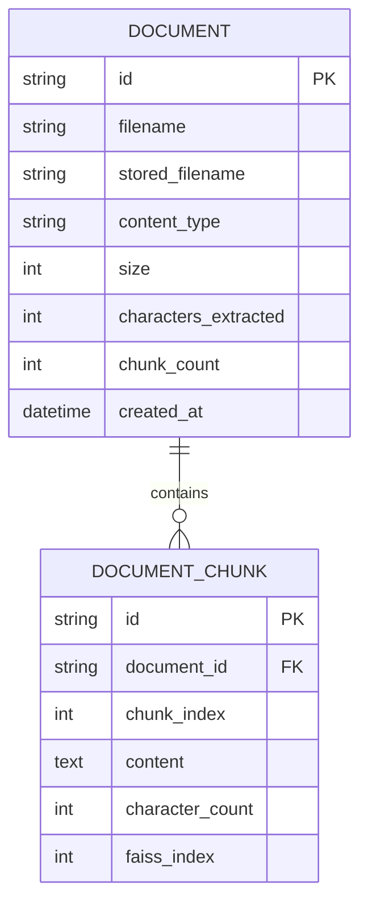
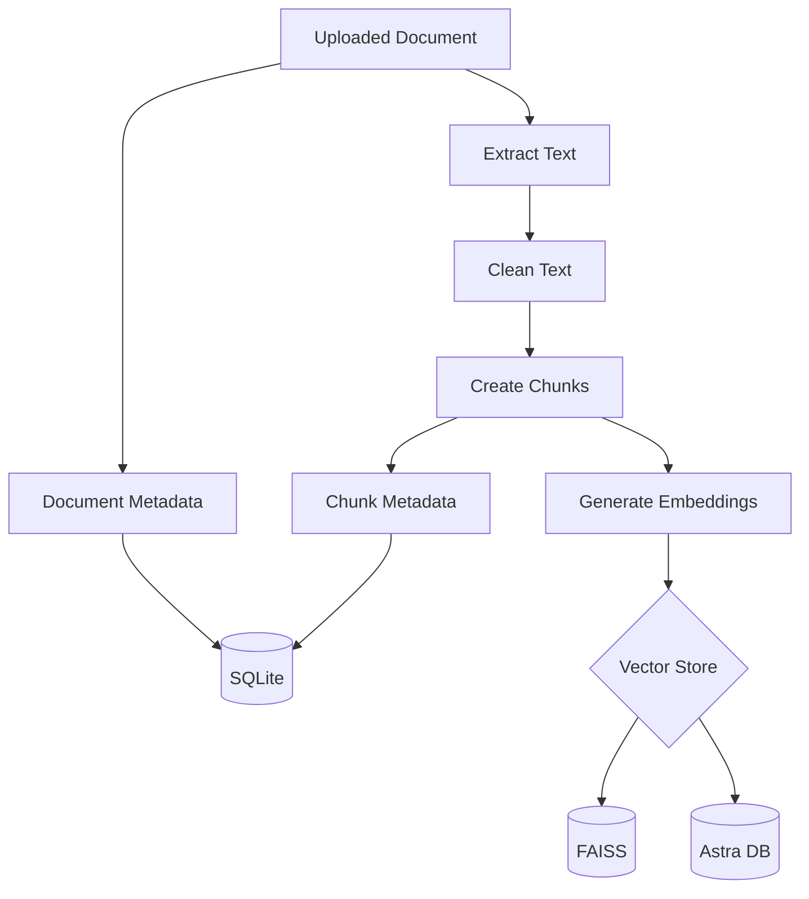
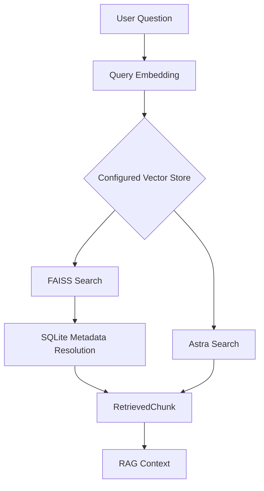

# Database and Vector Storage Design

## 1. Introduction

The AI-Powered Software Engineering Assistant uses two different
categories of data storage:

1. Relational metadata storage
2. Vector storage for semantic retrieval

These storage mechanisms solve different problems.

SQLite stores structured application metadata about documents and
document chunks.

FAISS or Astra DB stores vector embeddings used for semantic
similarity search.

The architecture can be summarized as:

```text
                    Application
                         |
              +----------+----------+
              |                     |
              v                     v
           SQLite              Vector Store
              |                     |
              |                +----+----+
              |                |         |
              |                v         v
              |              FAISS     Astra
              |
              v
      Application Metadata
```

---

# 2. Why Two Types of Storage Are Required

A relational database is suitable for structured application data.

For example:

```text
Document ID
Filename
Content Type
File Size
Created Date
Chunk Count
```

Vector search solves a different problem.

Instead of searching structured fields, the system needs to answer:

> Which document chunks are semantically most similar to this
> question?

For this purpose, text is converted into high-dimensional vector
embeddings.

Therefore:

```text
Relational Database
        |
        v
Structured metadata
```

and:

```text
Vector Store
        |
        v
Semantic similarity retrieval
```

have different responsibilities.

---

# 3. Relational Data Model

The current application contains two primary relational entities:

```text
Document

DocumentChunk
```

Their relationship is:

```text
Document
    |
    | 1
    |
    | contains
    |
    | N
    v
DocumentChunk
```

One document can contain many chunks.

Each chunk belongs to one document.

---

# 4. Entity Relationship Diagram



---

# 5. Document Entity

The `Document` entity represents an uploaded file.

The main fields are:

| Field | Purpose |
|---|---|
| `id` | Unique document identifier |
| `filename` | Original uploaded filename |
| `stored_filename` | Name used for stored file |
| `content_type` | MIME/content type |
| `size` | File size |
| `characters_extracted` | Number of extracted text characters |
| `chunk_count` | Number of generated chunks |
| `created_at` | Upload/creation time |

A document record represents the application-level identity of an
uploaded knowledge source.

---

# 6. Document Identifier

Documents use unique identifiers.

Conceptually:

```text
Uploaded Document
       |
       v
Generate Document UUID
       |
       v
Document Record
```

Using an identifier independent of the filename is useful because two
different uploaded files could potentially have the same filename.

For example:

```text
architecture.pdf
architecture.pdf
```

should not be assumed to represent the same logical document merely
because their filenames are identical.

---

# 7. DocumentChunk Entity

Each document is divided into smaller searchable chunks.

Each chunk contains:

| Field | Purpose |
|---|---|
| `id` | Unique chunk identifier |
| `document_id` | Parent document |
| `chunk_index` | Position inside document |
| `content` | Extracted chunk text |
| `character_count` | Size of chunk |
| `faiss_index` | FAISS vector position when applicable |

For example:

```text
Document
ID = DOC-123

        |
        +---- Chunk 0
        |
        +---- Chunk 1
        |
        +---- Chunk 2
        |
        +---- Chunk 3
```

Each chunk is independently embedded and searchable.

---

# 8. Why Chunk IDs Are Important

Every chunk receives a unique identifier before vector indexing.

Conceptually:

```text
Chunk Text
    |
    +-- chunk_id
    +-- document_id
    +-- filename
    +-- chunk_index
```

This identifier provides a stable relationship between the logical
chunk and its vector representation.

This is particularly useful for Astra because the chunk UUID can be
used directly as the vector document identifier.

---

# 9. Chunk Index vs Vector Index

Two different indexes exist in the FAISS implementation.

They should not be confused.

## Chunk Index

```text
chunk_index
```

represents the position of a chunk inside its source document.

Example:

```text
Document A

Chunk 0
Chunk 1
Chunk 2
```

## FAISS Index

```text
faiss_index
```

represents the vector position inside the FAISS index.

Example:

```text
FAISS

Vector position 0
Vector position 1
Vector position 2
...
```

Therefore:

```text
chunk_index
    =
position inside document
```

while:

```text
faiss_index
    =
position inside FAISS vector index
```

They represent different concepts.

---

# 10. Embedding Representation

Each document chunk is converted into an embedding using:

```text
sentence-transformers/all-MiniLM-L6-v2
```

The embedding dimension is:

```text
384
```

Conceptually:

```text
Chunk:

"Apache Kafka is used for asynchronous communication."

                    |
                    v

             Embedding Model

                    |
                    v

[V1, V2, V3, ... V384]
```

These vectors are used for semantic retrieval.

---

# 11. Normalized Embeddings

The application currently generates normalized embeddings.

Conceptually:

```text
Raw Vector
    |
    v
Normalization
    |
    v
Unit-Length Vector
```

Normalization is useful because the FAISS implementation uses:

```text
IndexFlatIP
```

with normalized vectors.

For normalized vectors, inner-product ranking corresponds to
cosine-similarity-style ranking.

---

# 12. FAISS Storage Design

FAISS provides the local vector-search implementation.

The vector data is stored in:

```text
data/vector_store/index.faiss
```

Conceptually:

```text
FAISS Index

Position 0 -> [384-D vector]
Position 1 -> [384-D vector]
Position 2 -> [384-D vector]
Position 3 -> [384-D vector]
...
```

FAISS itself does not provide the same application metadata model as
the relational database.

Therefore, SQLite maintains the mapping between a FAISS position and
the corresponding chunk.

---

# 13. FAISS-to-SQLite Mapping

The mapping is:

```text
FAISS Vector Position
         |
         v
DocumentChunk.faiss_index
         |
         v
DocumentChunk
         |
         +-- content
         +-- document_id
         +-- chunk_index
         |
         v
Document
         |
         +-- filename
```

Example:

```text
FAISS position = 12

        |
        v

DocumentChunk
faiss_index = 12
chunk_index = 3
document_id = ABC

        |
        v

Document
id = ABC
filename = architecture.pdf
```

This allows semantic search results from FAISS to be converted back
into meaningful application data.

---

# 14. FAISS Ingestion Process

When FAISS is active:

```text
Document
   |
   v
Extract + Clean
   |
   v
Chunks
   |
   v
Generate Embeddings
   |
   v
Load FAISS Index
   |
   v
Current ntotal = N
   |
   v
Add New Embeddings
   |
   v
Assign Positions
N, N+1, N+2...
   |
   v
Save FAISS Index
   |
   v
Store Positions in SQLite
```

For example, suppose FAISS currently contains:

```text
9 vectors
```

Three new chunks are uploaded.

The new positions become:

```text
9
10
11
```

and these values are stored in the corresponding
`DocumentChunk.faiss_index` records.

---

# 15. FAISS Retrieval Process

For a user question:

```text
Question
   |
   v
Query Embedding
   |
   v
FAISS Search
   |
   v
Positions + Scores
```

Suppose FAISS returns:

```text
Position 7
Position 2
Position 5
```

The application then performs metadata resolution:

```text
7 -> DocumentChunk where faiss_index = 7

2 -> DocumentChunk where faiss_index = 2

5 -> DocumentChunk where faiss_index = 5
```

The corresponding content and document information can then be used
by the RAG pipeline.

---

# 16. Astra DB Storage Design

Astra uses a different approach.

Instead of storing only the vector and maintaining a separate
position mapping, the Astra record contains both the vector and
retrieval metadata.

Conceptually:

```json
{
  "_id": "chunk-uuid",
  "document_id": "document-uuid",
  "filename": "architecture.pdf",
  "chunk_index": 3,
  "content": "The service uses Kafka...",
  "$vector": [
    0.012,
    -0.034,
    0.082
  ]
}
```

The actual vector contains 384 dimensions.

---

# 17. Astra Collection Configuration

The current Astra collection is:

```text
software_engineering_chunks
```

Vector dimension:

```text
384
```

Similarity metric:

```text
cosine
```

The embedding itself is generated locally using MiniLM.

Astra is responsible for storing and searching the vectors, rather
than generating the embeddings in the current architecture.

---

# 18. Astra Ingestion Process

When Astra is active:

```text
Document
   |
   v
Extract + Clean
   |
   v
Generate Chunks
   |
   v
Assign Chunk UUIDs
   |
   v
Generate Embeddings
   |
   v
Create Astra Records
   |
   +-- chunk ID
   +-- document ID
   +-- filename
   +-- chunk index
   +-- content
   +-- vector
   |
   v
Insert into Astra
```

SQLite document and chunk records are also maintained by the
application.

For Astra-backed chunks:

```text
faiss_index = NULL
```

because no FAISS vector-position mapping is required.

---

# 19. Astra Retrieval Process

Astra retrieval is:

```text
Question
   |
   v
Generate Query Embedding
   |
   v
Astra Vector Search
   |
   v
Top-K Documents
   |
   +-- content
   +-- filename
   +-- document ID
   +-- chunk ID
   +-- similarity
```

Unlike the FAISS path, the retrieval result already contains the
metadata required by the RAG service.

---

# 20. FAISS vs Astra Data Design

The two approaches can be compared structurally.

| Feature | FAISS | Astra |
|---|---|---|
| Vector storage | Local index | Cloud database |
| Vector search | Local | Remote |
| Chunk content with vector | No | Yes |
| Metadata mapping | SQLite | Stored with Astra record |
| Persistent application metadata | SQLite | SQLite still used by application |
| Vector identifier | Position | Chunk UUID |
| Network required for retrieval | No | Yes |
| Current embedding dimension | 384 | 384 |

The purpose of this comparison is architectural description rather
than declaring one implementation universally better.

---

# 21. Vector Store Abstraction

The application hides vector-storage selection behind a common
configuration.

```text
VECTOR_STORE=faiss
```

or:

```text
VECTOR_STORE=astra
```

The ingestion architecture becomes:

```text
                  index_chunks()
                       |
                 Read configuration
                       |
              +--------+--------+
              |                 |
              v                 v
           FAISS              Astra
```

Retrieval follows a similar abstraction:

```text
                 retrieve_chunks()
                        |
                  Read configuration
                        |
               +--------+--------+
               |                 |
               v                 v
         retrieve_from_faiss  retrieve_from_astra
               |                 |
               +--------+--------+
                        |
                        v
                 RetrievedChunk[]
```

This provides a consistent interface to the RAG layer.

---

# 22. Important Consistency Problem

During development, an important persistence issue was identified.

FAISS and SQLite are independent persistence systems.

At one point:

```text
FAISS vectors = 18
SQLite chunks = 9
```

This meant the FAISS index contained vectors that no longer had
corresponding chunk metadata in SQLite.

As a result, a request for:

```text
top_k = 5
```

could return five FAISS positions but only some positions could be
resolved to valid SQLite chunks.

For example:

```text
FAISS Search
     |
     +-- Position 14 -> No SQLite mapping
     +-- Position 3  -> Valid
     +-- Position 17 -> No SQLite mapping
     +-- Position 5  -> Valid
     +-- Position 8  -> Valid

Result:

Requested = 5
Resolved  = 3
```

This demonstrated that vector persistence and metadata persistence
must remain synchronized.

---

# 23. Consistent FAISS Baseline

After resetting the database and vector index consistently, the
system reached:

```text
FAISS vectors: 9
DB chunks:     9
Mapped:        9
```

with positions:

```text
0
1
2
3
4
5
6
7
8
```

The RAG endpoint then successfully resolved all requested retrieval
results.

This development incident demonstrates a real architectural issue
that should be considered in the final evaluation and discussion.

---

# 24. Distributed Persistence Problem

The ingestion process currently involves multiple persistence
operations.

For example with Astra:

```text
Insert vectors into Astra
          |
          v
Store metadata in SQLite
```

These operations do not share one database transaction.

A possible failure is:

```text
Astra insertion
      |
      v
SUCCESS

SQLite commit
      |
      v
FAILURE
```

The result could be:

```text
Astra vector exists

but

SQLite application metadata does not exist
```

This is an example of an orphaned vector record.

---

# 25. Reverse Failure Scenario

The reverse problem can also occur conceptually:

```text
SQLite metadata exists

but

vector data is missing
```

Then the application may show the document as available while
semantic retrieval cannot retrieve its vectors.

Therefore:

```text
Application Metadata
       +
Vector Index
```

must be treated as logically related data even though they are stored
in different persistence systems.

---

# 26. Why a Normal Database Transaction Is Not Enough

A SQLite transaction can guarantee consistency inside SQLite.

It cannot automatically roll back an external FAISS file or a remote
Astra operation.

For example:

```text
BEGIN SQLite Transaction

Insert Document
Insert Chunks

Insert into Astra

COMMIT SQLite
```

If one external operation fails, SQLite does not automatically know
how to restore the external vector store.

Similarly, Astra cannot automatically roll back a local SQLite
transaction.

This is a distributed consistency problem.

---

# 27. Possible Improvement: Indexing Status

A future version can add an ingestion state to each document.

For example:

```text
UPLOADED
    |
    v
PROCESSING
    |
    v
INDEXING
    |
    v
READY
```

Failure:

```text
PROCESSING
    |
    v
FAILED
```

A document would only become searchable when its status is:

```text
READY
```

This would make incomplete ingestion easier to detect and recover.

---

# 28. Possible Improvement: Compensating Operation

Suppose:

```text
Astra insert succeeds
```

but:

```text
SQLite commit fails
```

The application could execute a compensating operation:

```text
Delete newly inserted Astra chunk IDs
```

Conceptually:

```text
Insert Vector
     |
     v
Database Failure
     |
     v
Compensating Delete
     |
     v
Restore Consistency
```

This does not create a true distributed transaction but can reduce
orphaned data.

---

# 29. Possible Improvement: Idempotent Ingestion

Chunk UUIDs can also help make indexing operations idempotent.

An idempotent operation means repeating the same logical operation
does not create unwanted duplicate data.

For example:

```text
chunk_id = fixed UUID for current ingestion record
```

If a retry occurs, the system can determine whether that chunk was
already indexed rather than blindly inserting another copy.

This is particularly useful for:

- Network failures
- Retry mechanisms
- Recovery operations
- Background ingestion

---

# 30. Possible Improvement: Reconciliation

A reconciliation process could periodically compare application
metadata with vector storage.

For FAISS, it could check:

```text
FAISS ntotal

vs

mapped SQLite chunk count
```

For a vector database, it could verify expected chunk IDs.

Conceptually:

```text
SQLite Chunks
      |
      | compare
      |
Vector Records
      |
      v
Mismatch?
   /     \
 Yes      No
  |        |
  v        v
Repair     OK
```

This can help detect storage inconsistencies.

---

# 31. Possible Improvement: Re-indexing

Because document text remains available in application storage, a
future administrative operation could rebuild the vector index.

Conceptually:

```text
Stored Documents/Chunks
          |
          v
Regenerate Embeddings
          |
          v
Create New Vector Index
          |
          v
Replace/Reconcile Existing Index
```

Re-indexing is particularly useful when:

- Vector data becomes corrupted
- Embedding model changes
- Chunking strategy changes
- Vector-store implementation changes

---

# 32. Embedding Model Versioning

A future production-oriented design should also track which embedding
model generated each vector index.

For example:

```text
embedding_model =
sentence-transformers/all-MiniLM-L6-v2
```

This is important because embeddings produced by different models
should not normally be mixed in the same vector space without an
explicitly compatible design.

For example:

```text
Documents embedded using Model A

Question embedded using Model B

                ↓

Potentially incompatible vector spaces
```

The query and indexed documents should use the same compatible
embedding representation.

---

# 33. Chunking Versioning

The same principle applies to chunking.

Current configuration:

```text
chunk_size = 1000
chunk_overlap = 200
```

If the chunking configuration changes:

```text
1000 / 200

to

500 / 100
```

existing documents do not automatically receive the new chunk
structure.

A controlled experiment should therefore record the chunking
configuration associated with each index or dataset.

---

# 34. Data Flow During Upload

The complete storage flow is:



---

# 35. Data Flow During Retrieval



The key difference is:

```text
FAISS
   requires
SQLite metadata resolution
```

whereas:

```text
Astra
   returns
vector result + metadata
```

for the retrieval information stored with each vector record.

---

# 36. Data Security Considerations

Application credentials such as:

```text
GROQ_API_KEY

ASTRA_DB_APPLICATION_TOKEN

ASTRA_DB_API_ENDPOINT
```

are stored using environment variables rather than source code.

The local `.env` file is excluded from Git.

This prevents secrets from being intentionally stored in the
repository.

For a production deployment, additional measures would be required,
such as:

- Managed secret storage
- Authentication
- Authorization
- Encryption
- Access control
- Audit logging
- Secure document retention policies

These are outside the primary scope of the current research
prototype.

---

# 37. Research Importance of the Storage Design

The storage layer is not only an implementation detail.

It directly affects experimental variables such as:

```text
Retrieval latency
Retrieval ranking
Scalability
Persistence
Failure handling
Metadata resolution
```

Because both FAISS and Astra are supported behind a common retrieval
architecture, their behavior can be evaluated while keeping other
parts of the pipeline relatively stable.

---

# 38. Viva Questions and Answers

## Why do you need both SQLite and a vector database?

SQLite stores structured application metadata such as documents and
chunks. The vector store is optimized for semantic similarity search
over embeddings. They solve different storage problems.

## What is stored in FAISS?

FAISS stores the numerical vector embeddings used for similarity
search.

## How do you know which document a FAISS vector belongs to?

The FAISS vector position is stored in
`DocumentChunk.faiss_index`. After FAISS returns a position, the
application resolves the corresponding chunk from SQLite.

## What does `chunk_index` mean?

It represents the position of the chunk inside its original document.

## What does `faiss_index` mean?

It represents the position of the chunk's embedding inside the FAISS
vector index.

## Why is `faiss_index` NULL for Astra?

Astra stores each vector with a chunk identifier and metadata, so the
application does not need a FAISS-style positional mapping.

## Why are embeddings 384-dimensional?

The selected `all-MiniLM-L6-v2` embedding model outputs
384-dimensional embeddings.

## Can you store vectors directly in SQLite?

It is technically possible to store numerical data in a relational
database, but the current architecture uses specialized vector-search
systems for semantic similarity retrieval. SQLite is used for
application metadata.

## What happens if FAISS and SQLite become inconsistent?

Some FAISS search results may point to positions for which no valid
chunk metadata exists. We encountered this during development. A
production-ready system would require stronger synchronization,
re-indexing, reconciliation, or compensating mechanisms.

## Why is that issue important academically?

It demonstrates that building a RAG system involves more than calling
an LLM. Data ingestion, vector persistence, metadata consistency, and
failure recovery are important parts of the architecture.

---

# 39. Summary

The project's persistence architecture can be summarized as:

```text
                     DOCUMENT
                        |
                        v
                      CHUNKS
                        |
             +----------+----------+
             |                     |
             v                     v
       Relational Data          Embeddings
             |                     |
             v                     v
          SQLite              Vector Store
                              /          \
                             /            \
                          FAISS           Astra
```

SQLite maintains application metadata.

FAISS provides local vector search with positional metadata mapping.

Astra provides cloud vector search where chunk metadata can be stored
with the vector.

The modular design allows the same RAG pipeline to operate with
different vector-storage implementations while also exposing
important consistency and persistence challenges for further
research and improvement.