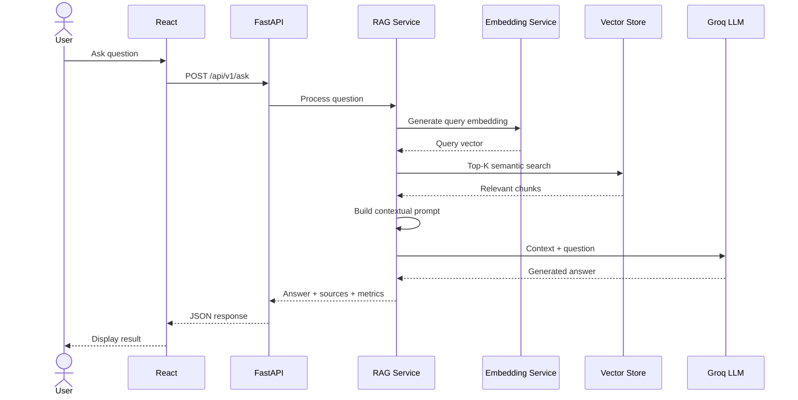

# REST API Documentation

## 1. Introduction

The AI-Powered Software Engineering Assistant exposes a REST API
implemented using FastAPI.

The API acts as the communication layer between the React frontend
and the backend services.

The frontend does not directly communicate with:

- SQLite
- FAISS
- Astra DB
- Sentence Transformer model
- Groq LLM

Instead, all communication occurs through the FastAPI API.

```text
User
  |
  v
React Frontend
  |
  | HTTP / JSON
  v
FastAPI REST API
  |
  +-- Document Processing
  +-- Embedding Service
  +-- Vector Retrieval
  +-- Database
  +-- RAG Service
  +-- LLM Service
```

---

# 2. Base URL

During local development, the backend runs on:

```text
http://localhost:8000
```

Version 1 of the application API is exposed under:

```text
/api/v1
```

Therefore, the frontend API base URL is:

```text
http://localhost:8000/api/v1
```

The frontend can configure this using:

```text
VITE_API_BASE_URL
```

If the environment variable is not configured, the current frontend
uses the local backend URL as the default.

---

# 3. API Versioning

The API uses a versioned URL structure:

```text
/api/v1
```

This provides a path for future API changes.

For example:

```text
/api/v1/ask

/api/v2/ask
```

could coexist if a future version introduced incompatible request or
response changes.

---

# 4. Current API Endpoints

The main API operations are:

| Method | Endpoint | Purpose |
|---|---|---|
| GET | `/` | Root application information |
| GET | `/api/v1/health` | Check backend health |
| GET | `/api/v1/documents` | List uploaded documents |
| POST | `/api/v1/documents/upload` | Upload and index a document |
| GET | `/api/v1/documents/{document_id}/chunks` | Inspect document chunks |
| POST | `/api/v1/ask` | Ask a RAG question |

---

# 5. Root Endpoint

## Request

```http
GET /
```

## Purpose

The root endpoint confirms that the FastAPI application is running.

## Example Response

```json
{
  "message": "AI RAG Software Engineering Assistant API"
}
```

This endpoint is outside the `/api/v1` prefix.

---

# 6. Health Endpoint

## Request

```http
GET /api/v1/health
```

## Purpose

The health endpoint can be used by the frontend or operational tools
to verify that the backend application is available.

A response contains service-level health information.

Conceptually:

```json
{
  "status": "healthy",
  "service": "AI RAG Software Engineering Assistant",
  "version": "1.0.0"
}
```

The frontend represents this response using a TypeScript interface
similar to:

```typescript
export interface HealthResponse {
  status: string;
  service: string;
  version: string;
}
```

---

# 7. List Documents

## Request

```http
GET /api/v1/documents
```

## Purpose

Returns documents currently registered in the application's
knowledge base.

The frontend uses this endpoint to populate the document list shown
in the sidebar.

## Example Response

```json
[
  {
    "id": "document-uuid",
    "filename": "architecture.pdf",
    "stored_filename": "stored-file-name.pdf",
    "content_type": "application/pdf",
    "size": 250000,
    "characters_extracted": 15000,
    "chunk_count": 18,
    "created_at": "2026-09-20T10:30:00"
  }
]
```

---

# 8. Document Response Model

A document contains:

| Field | Description |
|---|---|
| `id` | Unique document identifier |
| `filename` | Original uploaded filename |
| `stored_filename` | Filename used for storage |
| `content_type` | Uploaded content type |
| `size` | File size |
| `characters_extracted` | Number of extracted text characters |
| `chunk_count` | Number of generated chunks |
| `created_at` | Document creation timestamp |

The corresponding frontend interface is:

```typescript
export interface Document {
  id: string;
  filename: string;
  stored_filename: string;
  content_type: string;
  size: number;
  characters_extracted: number;
  chunk_count: number;
  created_at: string;
}
```

---

# 9. Upload Document

## Request

```http
POST /api/v1/documents/upload
```

## Content Type

The endpoint accepts:

```text
multipart/form-data
```

The uploaded file is sent using the field:

```text
file
```

Conceptually:

```text
POST /documents/upload

Form Data:

file = architecture.pdf
```

---

# 10. Upload Processing

The upload endpoint performs significantly more work than simply
saving a file.

The processing pipeline is:

```text
HTTP Upload
     |
     v
Validate File
     |
     v
Store File
     |
     v
Extract Text
     |
     v
Clean Text
     |
     v
Create Chunks
     |
     v
Generate Embeddings
     |
     v
Index in Configured Vector Store
     |
     v
Persist Metadata
     |
     v
Return Upload Response
```

Therefore, successful completion means that the document has passed
through the ingestion pipeline and is available to the application's
knowledge-base workflow.

---

# 11. Upload Response

A successful upload returns information similar to:

```json
{
  "document_id": "document-uuid",
  "filename": "architecture.pdf",
  "content_type": "application/pdf",
  "size": 250000,
  "characters_extracted": 15000,
  "chunk_count": 18,
  "message": "Document uploaded and indexed successfully using ASTRA."
}
```

The frontend represents the response using:

```typescript
export interface DocumentUploadResponse {
  document_id: string;
  filename: string;
  content_type: string;
  size: number;
  characters_extracted: number;
  chunk_count: number;
  message: string;
}
```

---

# 12. Configured Vector Store During Upload

The upload pipeline uses the configured vector backend.

For example:

```text
VECTOR_STORE=faiss
```

results in:

```text
Chunks
   |
   v
Embeddings
   |
   v
FAISS Index
```

while:

```text
VECTOR_STORE=astra
```

results in:

```text
Chunks
   |
   v
Embeddings
   |
   v
Astra DB
```

The API contract remains largely independent of this implementation
detail.

---

# 13. Document Chunk Endpoint

## Request

```http
GET /api/v1/documents/{document_id}/chunks
```

Example:

```text
GET /api/v1/documents/123e4567/chunks
```

## Purpose

This endpoint allows inspection of chunks generated from a specific
document.

It is useful for:

- Development
- Debugging
- Chunk-quality inspection
- Retrieval analysis
- Demonstration

Conceptually, the response contains the chunks associated with the
requested document.

---

# 14. Why Chunk Inspection Is Useful

RAG quality depends heavily on the quality of the chunks supplied to
the retrieval system.

Suppose the original document contains:

```text
The Payment Service publishes payment events through Apache Kafka.
The Notification Service consumes these events asynchronously.
```

A useful chunk might preserve the complete information.

A poor chunk boundary might instead create:

```text
Chunk 1:

The Payment Service publishes payment
```

and:

```text
Chunk 2:

events through Apache Kafka. The Notification...
```

Chunk inspection allows these issues to be observed during
development and experimentation.

---

# 15. Ask Endpoint

The `/ask` endpoint is the central RAG endpoint.

## Request

```http
POST /api/v1/ask
```

## Content Type

```text
application/json
```

## Example Request

```json
{
  "question": "How does the Payment Service communicate with the Notification Service?",
  "top_k": 5
}
```

---

# 16. Ask Request Model

The request contains:

| Field | Type | Description |
|---|---|---|
| `question` | string | User's natural-language question |
| `top_k` | integer | Maximum number of chunks requested from retrieval |

The current validation includes:

```text
question:
minimum length = 2
maximum length = 2000

top_k:
minimum = 1
maximum = 10
default = 5
```

The corresponding frontend interface is:

```typescript
export interface AskRequest {
  question: string;
  top_k?: number;
}
```

If the frontend does not explicitly provide `top_k`, it currently
uses:

```text
5
```

---

# 17. Ask Endpoint Processing

The `/ask` endpoint initiates the complete online RAG pipeline.



---

# 18. Ask Response

A successful response has the following general structure:

```json
{
  "question": "How does the Payment Service communicate with the Notification Service?",
  "answer": "The Payment Service communicates with the Notification Service asynchronously using Apache Kafka.",
  "sources": [
    {
      "source_number": 1,
      "chunk_id": "chunk-uuid",
      "document_id": "document-uuid",
      "filename": "test_document.txt",
      "chunk_index": 0,
      "score": 0.767905
    }
  ],
  "retrieval": {
    "top_score": 0.767905,
    "top_k_requested": 5,
    "chunks_retrieved": 3,
    "retrieval_time_ms": 2682.04,
    "generation_time_ms": 2199.99,
    "total_time_ms": 4882.06
  }
}
```

The exact values depend on the indexed documents, selected vector
store, model, network conditions, and query.

---

# 19. Ask Response Model

The response contains three major output categories:

```text
Generated Answer

Retrieved Evidence

Performance Metadata
```

Conceptually:

```text
AskResponse
    |
    +-- question
    |
    +-- answer
    |
    +-- sources[]
    |
    +-- retrieval
```

---

# 20. SourceReference

Each retrieved source is represented using:

```typescript
export interface SourceReference {
  source_number: number;
  chunk_id: string;
  document_id: string;
  filename: string;
  chunk_index: number;
  score: number;
}
```

The fields have the following meaning:

| Field | Purpose |
|---|---|
| `source_number` | Source number used in answer context |
| `chunk_id` | Unique chunk identifier |
| `document_id` | Parent document identifier |
| `filename` | Original source filename |
| `chunk_index` | Position inside source document |
| `score` | Similarity value returned by retrieval |

---

# 21. Why Source References Are Returned

A normal chatbot response could contain only:

```json
{
  "answer": "Kafka is used."
}
```

The RAG application instead provides:

```text
Answer
+
Source Information
```

This makes it possible to inspect which retrieved evidence was
associated with generation.

Source references support:

- Traceability
- Debugging
- Retrieval evaluation
- User verification
- Citation analysis

---

# 22. RetrievalMetadata

The API also returns performance information.

The frontend type is:

```typescript
export interface RetrievalMetadata {
  top_score: number | null;
  top_k_requested: number;
  chunks_retrieved: number;
  retrieval_time_ms: number;
  generation_time_ms: number;
  total_time_ms: number;
}
```

---

# 23. Top Score

`top_score` represents the score of the highest-ranked retrieved
chunk.

Example:

```json
{
  "top_score": 0.767905
}
```

This should not automatically be interpreted as a universal
confidence score.

Different retrieval backends can expose similarity values with
different numerical behavior.

Therefore:

```text
Higher score across different systems
```

does not automatically mean:

```text
Better answer
```

The score is most useful together with retrieval ranking and
evaluation results.

---

# 24. Top-K Requested vs Chunks Retrieved

The response distinguishes between:

```text
top_k_requested
```

and:

```text
chunks_retrieved
```

For example:

```json
{
  "top_k_requested": 5,
  "chunks_retrieved": 5
}
```

Ideally the requested number of valid results is returned when enough
indexed chunks exist.

However, the distinction is useful for detecting situations where
fewer valid results are available.

This was particularly useful during development when FAISS and
SQLite became inconsistent.

---

# 25. Retrieval Time

`retrieval_time_ms` measures the retrieval stage.

It includes operations associated with obtaining the relevant
document chunks, including query embedding and vector retrieval in
the current RAG processing flow.

Example:

```json
{
  "retrieval_time_ms": 2682.04
}
```

This measurement can later be used in performance experiments.

---

# 26. Generation Time

`generation_time_ms` measures the LLM generation stage.

Example:

```json
{
  "generation_time_ms": 2199.99
}
```

This value may depend on factors such as:

- LLM provider
- Model
- Prompt size
- Retrieved context
- Network conditions
- Generated answer length

---

# 27. Total Time

`total_time_ms` represents the overall measured RAG processing time.

Example:

```json
{
  "total_time_ms": 4882.06
}
```

Conceptually:

```text
Question Received
      |
      v
Retrieval
      |
      v
Generation
      |
      v
Response Ready
```

This metric is useful for evaluating end-to-end response latency.

---

# 28. Why No `grounded: true` Field Is Returned

The API deliberately does not return a field such as:

```json
{
  "grounded": true
}
```

simply because retrieval succeeded.

Retrieving relevant-looking chunks does not prove that the generated
answer is fully grounded.

For example:

```text
Relevant Chunk Retrieved
        |
        v
LLM Adds Unsupported Statement
```

The retrieval stage may be successful while the final answer still
contains unsupported information.

Groundedness must therefore be evaluated separately.

This distinction is important for the research methodology.

---

# 29. Frontend API Service

The React application centralizes backend communication inside:

```text
src/services/api.ts
```

The service provides operations such as:

```typescript
getHealth()

getDocuments()

uploadDocument()

askQuestion()
```

This produces the frontend architecture:

```text
React Component
      |
      v
API Service
      |
      v
FastAPI
```

instead of every component implementing its own HTTP logic.

---

# 30. Generic Response Handling

The frontend uses a common response handler.

Conceptually:

```typescript
async function handleResponse<T>(
  response: Response,
): Promise<T> {
  if (!response.ok) {
    throw new Error(...);
  }

  return response.json() as Promise<T>;
}
```

This centralizes HTTP error processing and JSON conversion.

---

# 31. Document Upload from Frontend

The frontend creates:

```typescript
const formData = new FormData();

formData.append("file", file);
```

and sends:

```text
POST /documents/upload
```

The browser automatically generates the appropriate multipart request
for the file.

---

# 32. Question Submission from Frontend

The frontend sends:

```typescript
{
  question: request.question,
  top_k: request.top_k ?? 5
}
```

to:

```text
POST /ask
```

using:

```text
Content-Type: application/json
```

The returned `AskResponse` is then added to the conversation state.

---

# 33. CORS

During development, the frontend and backend run on different
origins.

Frontend:

```text
http://localhost:5173
```

Backend:

```text
http://localhost:8000
```

FastAPI therefore configures Cross-Origin Resource Sharing (CORS).

The current development configuration allows:

```text
http://localhost:5173
```

This enables the React application to call the FastAPI backend from
the browser.

---

# 34. API Validation

FastAPI and Pydantic provide request validation.

For example:

```text
top_k < 1
```

or:

```text
top_k > 10
```

does not satisfy the current request model.

Similarly, the question has configured minimum and maximum lengths.

This provides validation before the request enters the complete RAG
processing pipeline.

---

# 35. Error Handling

Errors can occur at several stages:

```text
HTTP Request
     |
     +-- Validation Error
     |
     +-- Unsupported File
     |
     +-- Text Extraction Error
     |
     +-- Embedding Error
     |
     +-- Vector Store Error
     |
     +-- Database Error
     |
     +-- LLM Provider Error
```

The frontend checks whether the HTTP response succeeded.

When an error response contains a backend `detail`, the frontend can
display that message to the user.

A production version could further standardize error responses using
application-specific error codes.

---

# 36. API and RAG Separation

The API should not itself implement every RAG operation.

Instead:

```text
API Route
    |
    v
RAG Service
    |
    +-- Retrieval Service
    +-- Embedding Service
    +-- Vector Store
    +-- LLM Service
```

This separation keeps HTTP transport concerns independent from AI
business logic.

---

# 37. API Role in Experimental Evaluation

The API response structure was designed to expose data useful for
experimentation.

For each question, the application can collect:

```text
Question

Generated answer

Retrieved sources

Similarity scores

Top-K

Retrieval time

Generation time

Total time
```

These values can later be stored in the evaluation dataset.

For example:

```text
Question ID
Question
Expected evidence
Retrieved evidence
Generated answer
Top-K
Retrieval time
Generation time
Groundedness score
Correctness score
```

This connects the software implementation directly to the research
evaluation.

---

# 38. Example End-to-End API Flow

Suppose the knowledge base contains:

```text
test_document.txt
```

with:

```text
The Payment Service is implemented using Spring Boot.

Apache Kafka is used for asynchronous communication between
the Payment Service and Notification Service.

Redis is used to cache frequently requested payment status data.

The service is deployed using Docker and Kubernetes.
```

The user asks:

```text
How does the Payment Service communicate with the
Notification Service?
```

The frontend sends:

```json
{
  "question": "How does the Payment Service communicate with the Notification Service?",
  "top_k": 5
}
```

The backend:

```text
Generates query embedding
        ↓
Searches vector store
        ↓
Retrieves test_document.txt
        ↓
Builds RAG context
        ↓
Sends context to LLM
        ↓
Generates answer
```

The response identifies `test_document.txt` as a retrieved source and
returns the generated answer with timing metadata.

This verifies the complete path:

```text
Document
   ↓
Upload API
   ↓
Embedding
   ↓
Vector Store
   ↓
Question API
   ↓
Retrieval
   ↓
LLM
   ↓
Answer
```

---

# 39. FastAPI Interactive Documentation

FastAPI automatically provides interactive API documentation during
development.

Common development interfaces include:

```text
/docs
```

for Swagger/OpenAPI-based interactive documentation and:

```text
/redoc
```

for an alternative documentation view.

These interfaces are useful for testing backend endpoints
independently of the React frontend.

---

# 40. Viva Questions and Answers

## What type of API does your application use?

The application uses REST APIs implemented using FastAPI. The React
frontend communicates with the backend using HTTP and JSON, while
file uploads use multipart form data.

## Which is the main RAG endpoint?

The main question-answering endpoint is:

```text
POST /api/v1/ask
```

It accepts the user question and Top-K value and returns the generated
answer, retrieved sources and performance metadata.

## Why do you return sources from the API?

The sources provide traceability between retrieval and the generated
answer. They are also useful for debugging and research evaluation.

## Why do you return latency information?

The project evaluates not only answer quality but also system
performance. Separating retrieval and generation time helps identify
where latency occurs.

## Why don't you return `grounded=true` when retrieval succeeds?

Retrieval success does not guarantee that every statement generated
by the LLM is supported by the retrieved context. Groundedness is an
evaluation property and should be measured separately.

## What is Top-K?

Top-K specifies how many of the highest-ranked document chunks are
requested from semantic retrieval before constructing the LLM
context.

## Why is the API versioned?

Versioning allows future API changes while maintaining compatibility
with existing clients.

## Can you test the backend without the frontend?

Yes. FastAPI exposes interactive OpenAPI documentation, allowing
endpoints to be tested directly.

---

# 41. Summary

The API layer provides a clean interface between the user interface
and the AI system.

```text
React Frontend
      |
      v
REST API
      |
      v
FastAPI
      |
      +-- Document Ingestion
      |
      +-- Semantic Retrieval
      |
      +-- RAG Orchestration
      |
      +-- LLM Generation
      |
      v
Answer + Evidence + Metrics
```

The `/ask` response is designed to provide not only a generated
answer but also the information required to inspect and experimentally
evaluate the RAG pipeline.