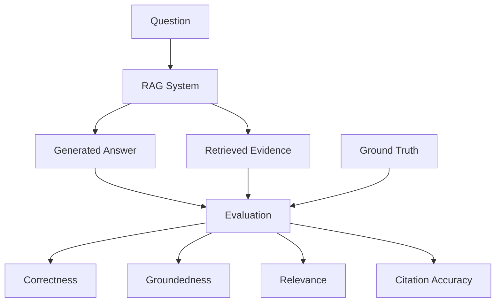

# Evaluation Methodology

## 1. Introduction

The implementation of a functional Retrieval-Augmented Generation
system alone is not sufficient to evaluate its effectiveness.

The proposed AI-Powered Software Engineering Assistant must be
evaluated experimentally to determine:

- Whether relevant information is retrieved
- Whether generated answers are correct
- Whether generated claims are supported by retrieved evidence
- Whether source references are appropriate
- How the system handles unsupported questions
- How retrieval configuration affects performance
- How much latency is introduced by retrieval and generation
- How RAG compares with an LLM-only baseline

The evaluation therefore considers both:

```text
Retrieval Quality
        +
Generation Quality
        +
System Performance
```

---

# 2. Evaluation Objectives

The evaluation has the following major objectives.

### Objective 1

Measure how effectively the retrieval system identifies relevant
document chunks.

### Objective 2

Evaluate the correctness of generated answers.

### Objective 3

Evaluate whether generated answers are supported by retrieved
document evidence.

### Objective 4

Evaluate whether the system appropriately handles questions for
which sufficient information is not present in the knowledge base.

### Objective 5

Compare RAG-based generation with an LLM-only baseline.

### Objective 6

Measure retrieval, generation, and end-to-end latency.

### Objective 7

Investigate the effect of retrieval parameters such as Top-K.

### Objective 8

Investigate the effect of document chunking configuration.

### Objective 9

Compare retrieval behavior using FAISS and Astra DB.

---

# 3. Research Questions

The experimental evaluation is designed around the following research
questions.

## RQ1

Does Retrieval-Augmented Generation improve answers to
project-specific software engineering questions compared with an
LLM-only approach?

## RQ2

How effectively does semantic retrieval identify relevant information
from software engineering documents?

## RQ3

How does Top-K affect retrieval quality, answer quality, and response
latency?

## RQ4

How does chunk size affect retrieval quality and generated answers?

## RQ5

How effectively does the system handle questions whose answers are
not contained in the indexed documents?

## RQ6

What are the retrieval, generation, and total latency characteristics
of the RAG system?

## RQ7

How do FAISS and Astra DB compare when used as vector-search backends
within the same RAG architecture?

---

# 4. Evaluation Architecture

The evaluation separates the RAG system into two major components:

```text
                 RAG System
                     |
          +----------+----------+
          |                     |
          v                     v
      Retrieval             Generation
          |                     |
          v                     v
Relevant Chunks          Generated Answer
```

This separation is important because an incorrect final answer can
have different causes.

For example:

```text
Incorrect Answer
      |
      +---- Relevant evidence was not retrieved
      |
      OR
      |
      +---- Relevant evidence was retrieved,
            but the LLM generated an incorrect answer
```

Therefore, retrieval and generation should be evaluated separately.

---

# 5. Evaluation Dataset

A controlled evaluation dataset will be created from a collection of
software engineering documents.

Possible document categories include:

- Software architecture
- API documentation
- Requirements
- Microservices design
- Deployment documentation
- Database documentation
- Coding standards
- Technical troubleshooting
- Cloud infrastructure
- Developer profiles or project documentation

The final evaluation dataset should use documents for which expected
answers and relevant evidence can be identified.

---

# 6. Question Dataset

A question set will be manually prepared from the evaluation
documents.

Each question should contain information such as:

```text
question_id
question
question_category
expected_answer
relevant_document
relevant_chunk or evidence
supported / unsupported
```

Example:

```text
Question ID:
Q001

Question:
How does the Payment Service communicate with the
Notification Service?

Expected Answer:
Using Apache Kafka for asynchronous communication.

Relevant Document:
test_document.txt

Relevant Evidence:
Apache Kafka is used for asynchronous communication between
the Payment Service and Notification Service.

Type:
Supported
```

---

# 7. Question Categories

The evaluation should include different types of questions.

## 7.1 Direct Factual Questions

The answer appears relatively explicitly in the document.

Example:

```text
Which technology is used for asynchronous communication between
the Payment Service and Notification Service?
```

Expected answer:

```text
Apache Kafka
```

---

## 7.2 Paraphrased Questions

The question uses different wording from the source document.

Document:

```text
Apache Kafka is used for asynchronous communication between the
Payment Service and Notification Service.
```

Question:

```text
How do the payment and notification services exchange messages?
```

This category is particularly important for evaluating semantic
retrieval.

---

## 7.3 Multi-Chunk Questions

The answer requires information distributed across more than one
chunk or section.

These questions help evaluate whether retrieving multiple chunks
provides useful context.

---

## 7.4 Technical Reasoning Questions

The question requires limited synthesis of information contained in
the documents.

The expected answer must still be supported by the indexed evidence.

---

## 7.5 Unsupported Questions

The indexed documents intentionally do not contain sufficient
information to answer the question.

Example:

```text
Does the candidate have production experience developing
blockchain applications using Rust?
```

if the indexed documents contain no such information.

The desired behavior is an abstention such as:

```text
The available documents do not provide enough information.
```

rather than an invented answer.

---

# 8. Supported vs Unsupported Dataset

The evaluation dataset should contain both:

```text
Supported Questions
        +
Unsupported Questions
```

A possible starting dataset could contain:

```text
Total questions = 100

Supported       = 80
Unsupported     = 20
```

This is only an initial experimental design target. The final number
should be based on the available evaluation corpus and the amount of
reliable manual annotation that can be produced.

A larger dataset is useful only when the expected answers and
evidence remain accurately labelled.

---

# 9. Ground Truth

Each supported evaluation question should have manually identified
ground truth.

Ground truth can contain:

```text
Expected answer

Relevant document ID

Relevant chunk ID(s)

Relevant evidence text
```

For example:

```text
Question:
How does the Payment Service communicate with the Notification
Service?

Expected Answer:
Apache Kafka is used for asynchronous communication.

Ground Truth Document:
test_document.txt

Ground Truth Chunk:
Chunk 0
```

Ground truth allows retrieval results to be evaluated objectively.

---

# 10. Retrieval Evaluation

Retrieval evaluation determines whether the semantic-search component
returns relevant chunks.

The major retrieval metrics can include:

```text
Hit Rate@K

Precision@K

Recall@K

Mean Reciprocal Rank (MRR)
```

---

# 11. Hit Rate@K

Hit Rate@K determines whether at least one relevant result appears in
the first K retrieved chunks.

For a single question:

```text
Hit@K = 1
```

if at least one relevant chunk appears within the Top-K results.

Otherwise:

```text
Hit@K = 0
```

Across N questions:

```text
Hit Rate@K =
Number of questions with at least one relevant result in Top-K
----------------------------------------------------------------
Total number of evaluated questions
```

Example:

```text
90 out of 100 questions retrieved relevant evidence in Top-5.

Hit Rate@5 = 90 / 100 = 0.90
```

---

# 12. Precision@K

Precision@K measures the proportion of retrieved chunks that are
relevant.

```text
Precision@K =
Number of relevant chunks in Top-K
-----------------------------------
K
```

Example:

```text
Top-5 results:

1 Relevant
2 Relevant
3 Irrelevant
4 Relevant
5 Irrelevant
```

Then:

```text
Precision@5 = 3 / 5 = 0.60
```

A higher Precision@K means less irrelevant information is being
included in the retrieved context.

---

# 13. Recall@K

Recall@K measures how many of the known relevant chunks were
successfully retrieved.

```text
Recall@K =
Number of relevant chunks retrieved in Top-K
---------------------------------------------
Total number of known relevant chunks
```

Suppose a question has four relevant chunks.

Top-5 retrieval returns three of them.

Then:

```text
Recall@5 = 3 / 4 = 0.75
```

Precision and recall measure different retrieval characteristics.

---

# 14. Mean Reciprocal Rank

Mean Reciprocal Rank evaluates how early the first relevant result
appears.

For a question:

```text
Reciprocal Rank =
1 / rank of first relevant result
```

Examples:

```text
Relevant result at rank 1:

RR = 1 / 1 = 1.0
```

```text
Relevant result at rank 2:

RR = 1 / 2 = 0.5
```

```text
Relevant result at rank 5:

RR = 1 / 5 = 0.2
```

MRR is the average Reciprocal Rank across all evaluated questions.

```text
MRR =
Sum of Reciprocal Ranks
-----------------------
Number of Questions
```

A higher MRR means relevant evidence tends to appear earlier in the
retrieval ranking.

---

# 15. Why Similarity Score Alone Is Not Enough

Similarity scores are useful for ranking retrieved chunks, but they
should not be treated as the only evaluation metric.

For example:

```text
Score = 0.80
```

does not automatically prove that the chunk contains the correct
answer.

Similarly, different vector-store implementations may expose
different numerical similarity values.

Therefore, evaluation should focus on:

```text
Actual relevance

Ranking position

Precision

Recall

Hit Rate

MRR
```

rather than simply comparing raw similarity scores.

---

# 16. Answer Quality Evaluation

Retrieving the correct evidence does not guarantee that the final
answer is correct.

The generation stage must therefore be evaluated separately.

The major answer-quality dimensions are:

```text
Correctness

Groundedness / Faithfulness

Relevance

Citation Accuracy

Unsupported Claims
```

---

# 17. Answer Correctness

Correctness measures whether the generated answer agrees with the
ground-truth answer.

A simple human-evaluation scale can be used.

Example:

```text
2 = Correct

1 = Partially correct

0 = Incorrect
```

Criteria:

### Score 2

The answer correctly addresses the question and contains no
significant factual error relative to the expected evidence.

### Score 1

The answer contains some correct information but is incomplete or
contains a minor error.

### Score 0

The answer is incorrect, unsupported, or fails to answer the
question.

The final dissertation should clearly document the rubric used.

---

# 18. Groundedness / Faithfulness

Groundedness measures whether claims in the generated answer are
supported by the retrieved context.

For example:

Retrieved context:

```text
The Payment Service uses Apache Kafka for asynchronous communication.
```

Generated answer:

```text
The Payment Service communicates asynchronously using Apache Kafka.
```

This statement is supported by the evidence.

However:

```text
The Payment Service uses Kafka with exactly 12 partitions and
three replicas.
```

would not be grounded if the retrieved context does not contain those
details.

---

# 19. Groundedness Scoring

A simple human-evaluation scale can be:

```text
2 = Fully grounded

1 = Partially grounded

0 = Contains substantial unsupported information
```

Alternatively, claim-level evaluation can be used.

For example:

```text
Generated answer contains 4 factual claims.

Supported claims = 3

Groundedness = 3 / 4 = 0.75
```

Claim-level evaluation is more detailed but requires more annotation
effort.

---

# 20. Answer Relevance

Answer relevance evaluates whether the generated response directly
addresses the user's question.

For example:

Question:

```text
Which messaging system connects the two services?
```

Relevant answer:

```text
Apache Kafka.
```

A long response containing unrelated deployment information may be
factually correct but less relevant to the question.

A possible scale is:

```text
2 = Directly relevant

1 = Partially relevant / unnecessarily broad

0 = Does not answer the question
```

---

# 21. Citation Accuracy

The RAG API returns source references.

Citation accuracy evaluates whether the referenced source actually
supports the generated answer.

For each answer:

```text
Citation Correct
        =
Referenced source contains evidence supporting the answer
```

A possible metric is:

```text
Citation Accuracy =
Correct supporting citations
----------------------------
Total evaluated citations
```

This is important because merely displaying a source does not
guarantee that the source supports the answer.

---

# 22. Unsupported-Question Evaluation

Unsupported questions are essential for hallucination-related
evaluation.

For each unsupported question, the system should ideally recognize
that the indexed documents do not provide sufficient information.

Possible outcomes include:

```text
Correct Abstention

Unsupported Answer

Ambiguous Response
```

---

# 23. Abstention Accuracy

A useful metric is:

```text
Abstention Accuracy =
Correctly abstained unsupported questions
------------------------------------------
Total unsupported questions
```

Example:

```text
Unsupported questions = 20

Correct abstentions = 17

Abstention Accuracy = 17 / 20 = 0.85
```

---

# 24. False Abstention

The reverse case must also be evaluated.

Suppose the knowledge base contains sufficient information, but the
system responds:

```text
The available documents do not provide enough information.
```

This is a false abstention.

Therefore, the evaluation should consider both:

```text
Unsupported question
        ->
Should abstain
```

and:

```text
Supported question
        ->
Should answer
```

Otherwise, a system could obtain a high unsupported-question score
simply by refusing too many questions.

---

# 25. Baseline Experiment

The primary comparison should include an LLM-only baseline.

## Baseline System

```text
Question
    |
    v
Same LLM
    |
    v
Answer
```

The LLM should not receive retrieved project context.

## Proposed System

```text
Question
    |
    v
Semantic Retrieval
    |
    v
Relevant Project Context
    |
    v
Same LLM
    |
    v
Answer
```

Using the same generation model helps isolate the effect of retrieval
augmentation.

---

# 26. Fair Baseline Comparison

For a fair comparison, as many variables as practical should remain
constant.

For example:

```text
Same questions

Same LLM

Comparable answer instructions

Same evaluation rubric

Same expected answers
```

The primary changed variable should be:

```text
Project-specific retrieved context
```

This helps determine whether retrieval augmentation contributes to
answer quality.

---

# 27. Baseline Evaluation Table

The experiment can produce a table such as:

| Metric | LLM Only | RAG |
|---|---:|---:|
| Correctness | TBD | TBD |
| Groundedness | TBD | TBD |
| Answer Relevance | TBD | TBD |
| Unsupported Answer Rate | TBD | TBD |
| Average Latency | TBD | TBD |

Values must be filled from actual experiments rather than assumed.

---

# 28. Top-K Experiment

The project should evaluate multiple Top-K configurations.

For example:

```text
K = 1

K = 3

K = 5

K = 10
```

All other parameters should remain fixed.

For each configuration, measure:

```text
Hit Rate@K

Precision@K

Recall@K

MRR

Answer Correctness

Groundedness

Retrieval Time

Generation Time

Total Time
```

---

# 29. Expected Top-K Trade-Off

The experiment investigates whether:

```text
Small K
```

may omit relevant evidence, while:

```text
Large K
```

may introduce irrelevant context.

This is a hypothesis to investigate, not a result that should be
assumed in advance.

Actual measurements will determine the observed behavior.

---

# 30. Chunk-Size Experiment

The project should also investigate different chunk sizes.

Example configurations:

```text
Configuration A

chunk_size = 500
chunk_overlap = 100
```

```text
Configuration B

chunk_size = 1000
chunk_overlap = 200
```

```text
Configuration C

chunk_size = 1500
chunk_overlap = 300
```

The exact experimental values can be finalized when the evaluation
dataset is prepared.

---

# 31. Chunking Evaluation

For each chunking configuration, measure:

```text
Number of generated chunks

Hit Rate@K

Precision@K

Recall@K

MRR

Answer correctness

Groundedness

Retrieval latency
```

This helps determine how chunk granularity affects the implemented
RAG pipeline.

---

# 32. Vector Store Experiment

The project currently supports:

```text
FAISS

Astra DB
```

The same document corpus and question dataset can be indexed using
both systems.

For a fair comparison, maintain:

```text
Same documents

Same chunking configuration

Same embedding model

Same query set

Same Top-K
```

Then compare:

```text
Retrieval ranking

Retrieval relevance

Retrieval latency

Operational characteristics
```

---

# 33. Important FAISS vs Astra Limitation

Raw similarity scores should not be directly compared as if they are
a universal confidence measure.

Development testing already showed that the same query can produce
similar rankings while FAISS and Astra expose different numerical
scores.

Therefore, instead of asking:

```text
Which backend has the largest similarity score?
```

the experiment should ask:

```text
Did the backend retrieve the correct evidence?

At what rank?

How long did retrieval take?
```

---

# 34. Latency Evaluation

The current API already exposes:

```text
retrieval_time_ms

generation_time_ms

total_time_ms
```

For multiple queries, calculate statistics such as:

```text
Mean

Median

Minimum

Maximum

Standard deviation
```

If the dataset is sufficiently large, percentile measurements such
as P95 may also be reported.

---

# 35. Why Multiple Runs Are Important

Network-based operations can vary between requests.

For example:

```text
Astra network latency

Groq API latency
```

may fluctuate.

Therefore, performance conclusions should not be based on one API
request.

A configuration can be executed multiple times and aggregated.

For example:

```text
Question Q001
Run 1
Run 2
Run 3
```

The number of repetitions should be recorded in the experimental
setup.

---

# 36. Warm-Up Consideration

The first embedding request can be slower because the model may need
to be loaded.

Therefore:

```text
Cold Start
```

and:

```text
Warm Execution
```

should not be silently mixed when interpreting latency.

One option is to perform a warm-up request before timing the main
experiment.

Alternatively, cold-start measurements can be reported separately.

---

# 37. Evaluation Result Record

Each experimental execution should produce a structured record.

Example:

```json
{
  "question_id": "Q001",
  "question": "How does the Payment Service communicate with the Notification Service?",
  "configuration": {
    "vector_store": "astra",
    "top_k": 5,
    "chunk_size": 1000,
    "chunk_overlap": 200
  },
  "retrieved_chunks": [],
  "generated_answer": "...",
  "expected_answer": "...",
  "retrieval_time_ms": 2500,
  "generation_time_ms": 2100,
  "total_time_ms": 4600
}
```

Evaluation annotations can later add:

```text
retrieval_relevant

correctness_score

groundedness_score

citation_correct

abstention_correct
```

---

# 38. Proposed Evaluation Dataset Structure

The repository can use:

```text
evaluation/
│
├── datasets/
│   ├── documents/
│   ├── questions.json
│   └── ground_truth.json
│
├── scripts/
│   ├── evaluate_retrieval.py
│   ├── evaluate_rag.py
│   └── evaluate_baseline.py
│
└── results/
    ├── retrieval/
    ├── rag/
    ├── baseline/
    └── experiments/
```

This keeps experimental data separate from application data.

---

# 39. Example Question Dataset

A question record could be:

```json
{
  "question_id": "Q001",
  "question": "How does the Payment Service communicate with the Notification Service?",
  "category": "paraphrased",
  "supported": true,
  "expected_answer": "Apache Kafka is used for asynchronous communication.",
  "relevant_documents": [
    "test_document.txt"
  ]
}
```

An unsupported example:

```json
{
  "question_id": "Q081",
  "question": "Does the system use RabbitMQ for payment processing?",
  "category": "unsupported",
  "supported": false,
  "expected_answer": null,
  "relevant_documents": []
}
```

---

# 40. Retrieval Evaluation Pipeline

```mermaid
flowchart TD

    A[Evaluation Questions]

    B[Generate Query Embedding]

    C[Vector Retrieval]

    D[Top-K Results]

    E[Ground Truth]

    F[Compare Results]

    G[Hit Rate@K]

    H[Precision@K]

    I[Recall@K]

    J[MRR]

    A --> B
    B --> C
    C --> D

    D --> F
    E --> F

    F --> G
    F --> H
    F --> I
    F --> J
```

---

# 41. Answer Evaluation Pipeline



---

# 42. Experiment Matrix

A controlled experiment matrix can be created.

For example:

| Experiment | Vector Store | Chunk Size | Overlap | Top-K |
|---|---|---:|---:|---:|
| E1 | FAISS | 1000 | 200 | 1 |
| E2 | FAISS | 1000 | 200 | 3 |
| E3 | FAISS | 1000 | 200 | 5 |
| E4 | FAISS | 1000 | 200 | 10 |
| E5 | Astra | 1000 | 200 | 1 |
| E6 | Astra | 1000 | 200 | 3 |
| E7 | Astra | 1000 | 200 | 5 |
| E8 | Astra | 1000 | 200 | 10 |

Chunk-size experiments can then be conducted separately so that too
many variables are not changed simultaneously.

---

# 43. Controlled Experiment Principle

Only one major independent variable should preferably be changed at a
time.

For example, to evaluate Top-K:

```text
Keep fixed:

Documents
Embedding model
Chunk size
Chunk overlap
Vector store
LLM

Change:

Top-K
```

To evaluate vector stores:

```text
Keep fixed:

Documents
Embeddings
Chunking
Questions
Top-K

Change:

FAISS vs Astra
```

This makes experimental conclusions easier to interpret.

---

# 44. Reproducibility

Each experiment should record its configuration.

Important values include:

```text
Embedding model

Embedding dimension

Vector store

Similarity metric

Chunk size

Chunk overlap

Top-K

LLM model

Question dataset version

Document dataset version

Experiment date

Number of repetitions
```

This allows the experiment to be repeated later.

---

# 45. Threats to Validity

The evaluation has several potential limitations.

### Dataset Size

A small document or question dataset may not represent large
real-world software projects.

### Manual Annotation

Expected answers and relevance labels may involve human judgment.

### Document Diversity

Results may vary depending on the types of software engineering
documents used.

### LLM Variability

Generated answers may vary between requests.

### External Service Latency

Network-based services can introduce variable latency.

### Embedding Model Dependence

Results obtained using MiniLM may not generalize to all embedding
models.

### Vector Backend Differences

Different vector stores may implement scoring and retrieval behavior
differently.

These limitations should be reported when interpreting results.

---

# 46. What the Evaluation Should Not Claim

The evaluation should not conclude that:

```text
RAG completely eliminates hallucination
```

because it does not guarantee this.

It should also avoid claiming:

```text
FAISS is always better than Astra
```

or:

```text
Astra is always better than FAISS
```

based on one experiment.

Instead, conclusions should be limited to the measured dataset,
configuration, and experimental conditions.

For example:

> Under the evaluated corpus and configuration, FAISS showed lower
> retrieval latency.

or:

> Under the evaluated question set, Top-5 achieved higher retrieval
> recall than Top-1.

Such statements can be supported by experimental measurements.

---

# 47. Expected Result Tables

The final dissertation can contain tables such as:

## Retrieval Performance

| Configuration | Hit@5 | Precision@5 | Recall@5 | MRR |
|---|---:|---:|---:|---:|
| FAISS | TBD | TBD | TBD | TBD |
| Astra | TBD | TBD | TBD | TBD |

## Answer Quality

| System | Correctness | Groundedness | Citation Accuracy |
|---|---:|---:|---:|
| LLM Only | TBD | TBD | N/A |
| RAG | TBD | TBD | TBD |

## Unsupported Questions

| System | Correct Abstentions | Unsupported Answers |
|---|---:|---:|
| LLM Only | TBD | TBD |
| RAG | TBD | TBD |

## Performance

| System | Retrieval ms | Generation ms | Total ms |
|---|---:|---:|---:|
| FAISS RAG | TBD | TBD | TBD |
| Astra RAG | TBD | TBD | TBD |

No result should be filled until the corresponding experiment has
actually been executed.

---

# 48. Expected Result Visualizations

The final results can also be presented graphically.

Potential visualizations include:

```text
Top-K vs Recall

Top-K vs Precision

Top-K vs Total Latency

Chunk Size vs Retrieval Accuracy

FAISS vs Astra Retrieval Latency

LLM-only vs RAG Correctness

LLM-only vs RAG Unsupported Answer Rate
```

These visualizations should be generated from experimental result
files rather than manually entered values.

---

# 49. Viva Explanation

If asked:

> How are you evaluating your project?

A concise answer is:

> I evaluate the system at three levels: retrieval quality, generated
> answer quality, and system performance. For retrieval, I use
> labelled questions and relevant evidence to calculate metrics such
> as Hit Rate, Precision, Recall and MRR. For generation, I evaluate
> correctness, groundedness, relevance and citation accuracy. I also
> include unsupported questions to measure abstention behavior.
> Finally, I measure retrieval, generation and total latency.

If asked:

> What is your baseline?

Answer:

> The primary baseline is the same LLM answering the same questions
> without retrieved project context. I compare this with the RAG
> configuration where relevant project evidence is retrieved and
> supplied to the same LLM.

If asked:

> How will you evaluate hallucination?

Answer:

> I do not treat retrieval similarity as proof that an answer is
> grounded. I compare factual claims in the generated answer with the
> retrieved evidence and also include questions for which the
> knowledge base intentionally contains no answer. This allows me to
> measure unsupported generation and abstention behavior.

If asked:

> Why use MRR?

Answer:

> MRR measures how early the first relevant chunk appears in the
> retrieval ranking. A system that consistently returns relevant
> evidence at rank one receives a higher MRR than one that retrieves
> the same evidence only at lower ranks.

If asked:

> Why not compare FAISS and Astra using similarity score?

Answer:

> Their raw score values are not necessarily directly comparable.
> Instead, I compare whether the correct evidence is retrieved, its
> ranking position, retrieval metrics and latency under controlled
> configurations.

---

# 50. Summary

The evaluation framework can be summarized as:

```text
                    Evaluation
                        |
        +---------------+---------------+
        |               |               |
        v               v               v
    Retrieval       Generation      Performance
        |               |               |
        v               v               v
    Hit Rate        Correctness     Retrieval Time
    Precision       Groundedness    Generation Time
    Recall          Relevance       Total Time
    MRR             Citations
                    Abstention
```

The evaluation is designed to determine not only whether the
application works technically, but how effectively the implemented
RAG architecture retrieves project-specific knowledge and generates
evidence-supported software engineering answers.